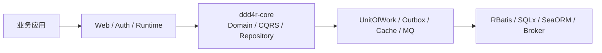
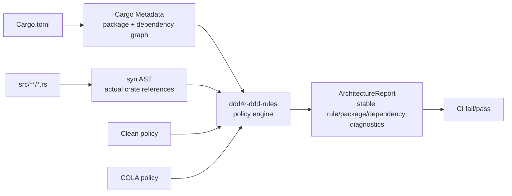

# ddd4r 架构入口

完整 C4 L1-L4 架构、核心类型关系、运行时上下文和 Outbox 时序图见
[docs/architecture/README.md](./docs/architecture/README.md)。

关键架构决策保存在 [docs/adrs](./docs/adrs)，任何改变模块一一映射、Tokio 运行时、
Registry 查找顺序、三套正式数据后端或 RBatis 上游策略的变更，都必须同步新增或更新 ADR。

## 架构规则执行链

`ddd4r-ddd-rules` 不依赖目录名做静态猜测后直接放行。Cargo Metadata 提供真实的
workspace/package/dependency 图，`syn` 再确认源码实际引用；Clean 与 COLA 包只负责选择
策略并输出稳定、可序列化的违规结果。

