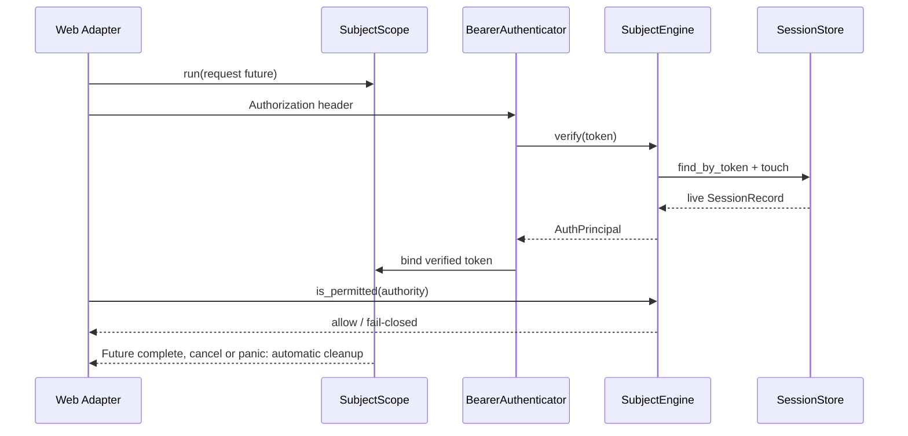

# 从 ddd4j 迁移到 ddd4r

## 兼容目标

ddd4r 移植 ddd4j 的领域和应用语义，不尝试在 Rust 中模拟 JVM、Spring 或 Java 反射。

| ddd4j | ddd4r |
|---|---|
| `ThreadContext` | Tokio `task_local!` + `ContextScope` |
| `BaseContext` | 全局 `Registry` |
| `RepositoryRegistry.repository(Order.class)` | `RepositoryRegistry::repository::<Order>()` |
| `aggregate.save()` | `aggregate.save().await` |
| `query.list()` | `query.list().await` |
| `event.publish()` | `event.publish().await` |
| Java Lambda 属性引用 | proc macro 生成的 `PropertyRef` |
| `CompletableFuture` / Reactor | Rust `Future` / `Stream` |
| ArchUnit | Cargo Metadata + `syn` 架构规则 |
| `SubjectKit` / `SubjectProvider` | `SubjectProviders` + `SubjectScope` |
| `AuthPrincipal` / `AuthRequest` | 同名 Rust value object + `AuthId` |
| Sa-Token / Security / Shiro `Subject` | 三个迁移 Provider，共享 `SubjectEngine` |

## 聚合示例

```rust,ignore
use ddd4r::prelude::*;

let mut order = Order::create(order_id, total)?;
order.save().await?;

let paid = Order::query()
    .and(OrderFields::STATUS.eq(OrderStatus::Paid)?)
    .page(1, 20)
    .list_page()
    .await?;
```

## 认证迁移

HTTP 入口必须先建立 `SubjectScope`，再验证传输层凭证。未知、过期、已撤销或禁用账号的 token
不会回退到当前用户，也不会写入上下文。

```rust,ignore
use ddd4r_auth::prelude::*;

SubjectScope::run(async {
    let subject = SubjectProviders::subject()?;
    let principal = BearerAuthenticator::authenticate(
        subject.as_ref(),
        request.headers().get("Authorization"),
    )
    .await?;

    if !subject.is_permitted("order:read").await? {
        return Err(AuthError::AccessDenied {
            authority: "order:read".to_owned(),
        });
    }
    handle_request(principal).await
})
.await
```



`ddd4r-auth-satoken`、`ddd4r-auth-security` 和 `ddd4r-auth-shiro` 是 Java 迁移入口名称，
不表示 Rust 进程内运行对应 JVM 框架。三者通过同一 conformance suite；尚未移植的 Java 专用
工具和 bridge 记录在 `port-manifest.toml`，完成前模块状态保持 `in_progress`。

## 明确差异

- Rust trait 方法需要通过 `ddd4r::prelude::*` 引入。
- Java 注解扫描改为 proc macro 和显式注册。
- 异步上下文跟随 Tokio task，而不是操作系统线程。
- ddd4r 首版补充 Unit of Work 和 Transactional Outbox，以闭合聚合保存到事件投递的链路。
- ddd4j 的默认 SM4 适配器将 mode、padding、key 和 IV 传空，冻结基线无法生成稳定兼容密文；
  ddd4r 使用认证型 `gm1` SM4/HMAC-SM3 信封，迁移时需要显式配置三类独立密钥并重加密旧数据。
