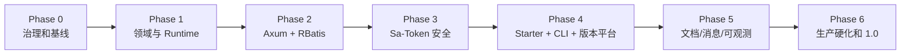
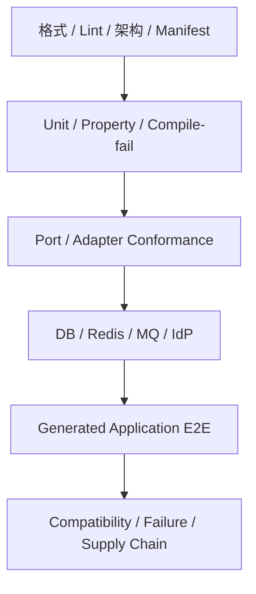

# ddd4r 开发实施计划

> 计划版本：2.0
>
> 状态：目标架构已确认，待从 Phase 0 开始实施
>
> 当前版本：`0.1.0-alpha.1`
>
> 最近更新：2026-07-23
>
> 架构依据：[ddd4r-Architecture.zh_CN.md](./ddd4r-Architecture.zh_CN.md)
>
> 当前实现证据：[PORT_STATUS.md](../PORT_STATUS.md)、[port-manifest.toml](../port-manifest.toml)

## 0. 结论

当前 ddd4r **没有 100% 完成**。

仓库已经实现部分 DDD、CQRS、Repository、Context、Cache、Outbox、Data 和 MQ 能力，但“业务开发者只选择 profile 或 starter，就能立即编写接口、鉴权和持久化逻辑”的产品闭环尚未形成。

旧计划把 82 个 ddd4j Maven artifact 一比一映射为 Rust crate，并以 `4 / 82 = 4.88%` 计算完成度。该数字仍可用于历史移植审计，但不再作为 ddd4r 产品进度。新计划以可运行的能力闭环作为完成标准：

| 产品能力 | 当前状态 | 1.0.0 目标 |
|---|---|---|
| DDD/CQRS 基础 | 部分实现 | 聚合、命令、查询、事件、事务闭环 |
| Web | 大量空壳 | Axum 默认可用，Actix 受支持 |
| Data | 三后端有部分实现 | RBatis 默认，SQLx/SeaORM 通过统一契约 |
| Security | 自研内核部分实现 | `sa-token-rs` + Web + Redis + 审计闭环 |
| 版本治理 | dependencies/BOM 为空壳 | 平台目录 + starter + CLI + lock |
| 项目生成 | 未实现 | `new/add/sync/upgrade/doctor` 可用 |
| Document | 关联项目存在，未集成 | Excel/Doc/PDF/OFD starter 可用 |
| Observability | 分散 | 默认日志、指标、追踪、健康检查 |
| 生产发布 | 部分门禁存在 | 外部工程、MSRV、SemVer、SBOM、许可证全绿 |

## 1. 计划目标与原则

### 1.1 最终目标

业务团队应能执行：

```bash
ddd4r new order-service --profile web-service
ddd4r add security-sa-token --features redis,jwt
ddd4r add document-excel
ddd4r add cqrs
ddd4r doctor
```

然后只关注：

- 领域模型、聚合不变量和值对象；
- Command、Query 和应用服务；
- HTTP 接口和 DTO；
- 权限码和业务鉴权规则；
- SQL/Mapper、数据库迁移和业务事务；
- 业务事件与消费者；
- 业务测试。

组件版本、基础 middleware、配置加载、错误映射、健康检查、可观测性和供应链检查由 ddd4r 平台负责。

### 1.2 实施原则

1. **Rust 生态优先**：复用成熟或正在建设的 Rust 项目，不重复实现同类框架。
2. **垂直切片优先**：先打通一个真实订单服务，再扩展横向组件数量。
3. **默认栈唯一**：Tokio + Axum + RBatis + `sa-token-rs` 是 1.0 默认组合。
4. **替代项隔离**：Actix、SQLx、SeaORM 使用独立 adapter/starter，避免 feature 冲突。
5. **证据驱动**：crate 存在或编译通过不等于能力完成；必须有 contract、集成或 E2E 证据。
6. **兼容但不被兼容绑架**：保留 ddd4j 迁移语义，淘汰 JVM 专属模块和无意义同形 API。
7. **业务工程可复现**：生成应用提交 `Cargo.lock`，CI 使用 `--locked`。
8. **先恢复基线再迁移**：当前用户已有 Cargo/MQ 改动，任何目录重构都必须在独立提交和全绿基线上进行。
9. **命名统一**：crate 目录和 package 使用 kebab-case；源码目录/文件使用 snake_case；类型使用 PascalCase。
10. **许可证先行**：LGPL、第三方 re-export 和静态链接风险在发布 starter 前完成评审。

## 2. 输入项目与职责分配

ddd4r 不是孤立开发，以下项目构成产品能力来源：

| 项目 | 作为 ddd4r 的职责 | ddd4r 不重复实现 |
|---|---|---|
| `ddd4j` | 架构思想、模块边界、Java 迁移语义 | JVM 框架桥、反射和注解扫描 |
| `ddd-4-rust` | 领域模型基础 | 第二套 Aggregate/Entity/ValueObject 内核 |
| `cqrs-4-rust` | CQRS 执行基础 | 第二套 Command/Query 总线 |
| `ddd-cqrs-4-rust-example` | 端到端行为基线 | 独立维护重复示例逻辑 |
| `sa-token-rs` | 登录、Session、RBAC、JWT、SSO、OAuth2、DAO、Web adapter | 自研同类鉴权全家桶 |
| `rbatis` | 默认 SQL/ORM 能力 | 数据库驱动和 MyBatis 风格引擎 |
| `easyexcel-rs` | Excel 读写与 Web 集成 | Excel 引擎 |
| `easydoc-rs` | Doc 读写与模板 | Doc 引擎 |
| `easypdf-rs` | PDF 读写、布局、模板和操作 | PDF 引擎 |
| `easyofd-rs` | OFD 读写、模板、签名和转换 | OFD 引擎 |

所有跨仓库集成必须固定到可审计版本或 revision，并在 `ddd4r-platform.toml` 中记录来源、许可证、MSRV、验证日期和公开 API 暴露情况。

## 3. 当前基线与启动条件

### 3.1 已确认基线

- 当前分支：`feature/0.1.x`；
- workspace 版本：`0.1.0-alpha.1`；
- Rust Edition：2024；
- 当前根 MSRV：1.97.1；
- workspace 当前使用 `"crates/*"` 与 `"modules/*/*"` 两个成员根；
- 当前共 90 个 Cargo manifest；
- 旧移植账本：4 complete、15 in_progress、63 scaffolded；
- `ddd4r-dependencies` 与 `ddd4r-bom` 是 `publish = false` 空包；
- `ddd4r` facade 仅组合 macros/cache/outbox；
- 根 workspace 当前有 `rbdc` git patch；
- `cargo metadata --locked --no-deps` 可通过，但完整 workspace `cargo check --locked` 会因 `Cargo.lock` 需要更新而失败；
- 工作树存在尚未提交的 Cargo/MQ 变更，不能在本计划中覆盖。

### 3.2 Phase 0 前置条件

开始结构迁移前必须：

- 明确当前 `Cargo.toml` 和两个 MQTT crate 的改动所有者；
- 补齐或确认对应 `Cargo.lock`；
- 保存 `cargo metadata`、`cargo test`、manifest validator 的基线输出；
- 给目录迁移建立独立分支或原子提交；
- 不使用批量删除替代 `git mv`；
- 保留现有代码和测试，除非新 ADR 明确废弃。

### 3.3 现有账本的处理

| 账本 | 新角色 |
|---|---|
| `port-manifest.toml` | ddd4j 迁移兼容账本，保留 |
| `public-api-manifest.json` | 旧 API 迁移结论和兼容窗口 |
| `PORT_STATUS.md` | 当前实现快照，不再代表产品 roadmap |
| 新 `capability-manifest.toml` | ddd4r 产品能力和闭环证据权威来源 |
| 新 `ddd4r-platform.toml` | 组件版本和支持级别权威来源 |

`capability-manifest.toml` 至少记录：

```toml
[[capability]]
id = "security.sa-token.axum.redis"
status = "planned"
owner = "security"
crates = [
  "ddd4r-security-sa-token",
  "ddd4r-web-axum",
  "ddd4r-starter-security-sa-token",
]
evidence = []
```

允许状态：

- `planned`
- `implementing`
- `integrated`
- `verified`
- `deprecated`
- `not-applicable`

只有 `verified` 计入产品完成度。

## 4. 1.0.0 完成定义

### 4.1 用户旅程完成

CLI 生成的仓库必须在 ddd4r monorepo 之外完成：

1. `cargo build --locked`
2. `cargo test --workspace --locked`
3. 启动 API 和健康端点
4. 登录并获得 token
5. 访问受保护订单接口
6. 执行 RBatis 事务
7. 同事务写入 Outbox
8. 后台发布事件并可观测重试
9. 导出 Excel
10. 优雅关闭并刷新 telemetry

### 4.2 技术门禁

| 类别 | 1.0.0 门禁 |
|---|---|
| Build | fmt、check、clippy、doc、test 全部 `--locked` |
| MSRV | 最低支持版本和 stable 通过 |
| API | semver check 无未批准破坏 |
| Features | 所有受支持 starter/profile 组合通过 |
| Security | auth failure fail closed；audit/audit logs 验证 |
| Data | RBatis/SQLx/SeaORM conformance；默认栈真实数据库通过 |
| Reliability | DB/Redis/MQ 故障、重试、回滚、优雅退出演练 |
| Supply chain | deny、audit、SBOM、provenance、license |
| External app | 非 path dependency 的生成工程 E2E 通过 |
| Documentation | quickstart、配置参考、迁移指南、发布说明完整 |

### 4.3 不计完成的情况

- 只有 `ModuleDescriptor` 或空 `lib.rs`；
- 只有接口定义，无 adapter；
- 只有 mock，无真实数据库/Redis/MQ 集成；
- 只在 monorepo path dependency 下成功；
- 需要业务项目手工猜测第三方版本；
- 安全异常被吞掉或默认允许；
- 运行时启动但无 readiness、shutdown 和诊断；
- 文档描述与 `capability-manifest.toml` 不一致。

## 5. 目标工作分解



各阶段以出口条件推进，不以日历时间自动完成。Phase 内允许无依赖工作并行，但不得跨越发布门禁。

## 6. Phase 0：架构、治理与可复现基线

### 6.1 目标

把新产品定义变成仓库权威，恢复可复现构建，建立版本平台和能力账本，解决后续重构的结构性风险。

### 6.2 工作包

| ID | 任务 | 交付物 |
|---|---|---|
| P0-01 | 批准新架构并处理冲突 ADR | 新 ADR：platform-not-literal-port |
| P0-02 | 闭合工作树、lock 和发布级验证基线 | 完整 locked check/clippy/test/doc 可执行且证据完整 |
| P0-03 | 建立能力账本 | `capability-manifest.toml` + validator |
| P0-04 | 建立版本平台目录 | `ddd4r-platform.toml` + JSON Schema/validator |
| P0-05 | 区分候选研究与正式选择 | `dependency-equivalence.toml` |
| P0-06 | 明确 MSRV 和版本列车 | Rust/组件兼容 ADR |
| P0-07 | 许可证评审 | LGPL 与 re-export 决策记录 |
| P0-08 | 目录迁移设计和路径映射 | `docs/migration/crate-layout-map.md` |
| P0-09 | 建立架构规则 | `ddd4r-test-architecture` 或临时 xtask |
| P0-10 | CI 分层 | quick、integration、compatibility、release jobs |

### 6.3 `ddd4r-platform.toml` 第一版

第一版必须覆盖：

- Tokio、Axum、Actix；
- `ddd-4-rust`、`cqrs-4-rust`；
- `sa-token-rs` core/web/DAO/plugin 组合；
- RBatis、SQLx、SeaORM；
- Serde、Reqwest、tracing、metrics、OpenTelemetry；
- Moka、redis-rs；
- MiniJinja、Askama；
- EasyExcel/EasyDoc/EasyPDF/EasyOFD；
- 当前 MQ 和 rbdc patch；
- 每个组件的 status、version/revision、MSRV、license、features、verified-at。

### 6.4 目录迁移规则

目标只有 `crates/` 一个产品 crate 根。迁移分组：

1. core/rules；
2. data；
3. security/auth；
4. web/runtime；
5. messaging；
6. extensions/document/template；
7. starter/test/tooling；
8. examples。

每组遵循：

```text
冻结基线
→ git mv
→ 修复 path/member/CI/docs
→ cargo metadata
→ 对应测试
→ 路径审计
→ 独立提交
```

禁止创建带下划线的 crate 目录，例如 `ddd4r_auth`。正确命名为 `ddd4r-auth`；其源码仍使用 `src/session_store.rs` 等 snake_case 文件名。

### 6.5 出口条件

- 新架构和 ADR 成为权威；
- `cargo metadata --locked` 通过；
- 所有现有测试要么通过，要么有可复现的已登记阻塞；
- capability/platform 两个 manifest 可被 CI 校验；
- LGPL 集成路线有明确决策或阻断标签；
- 目录迁移映射无 package 冲突和丢失测试；
- 旧 4.88% 只出现在迁移兼容语境。

### 6.6 回滚

目录迁移按组独立提交；任何组失败只回滚该组提交，不修改用户已有 Cargo/MQ 变更，不删除原始实现和测试。

## 7. Phase 1：领域、CQRS 与 Runtime 最小内核

### 7.1 目标

整合 `ddd-4-rust` 与 `cqrs-4-rust`，形成无 Web、无具体数据库也能测试的应用内核和显式 Runtime 装配模型。

### 7.2 目标 crates

```text
crates/ddd/ddd4r-domain/
crates/ddd/ddd4r-cqrs/
crates/ddd/ddd4r-application/
crates/ddd/ddd4r-event-sourcing/
crates/platform/ddd4r-config/
crates/platform/ddd4r-runtime/
crates/test/ddd4r-test/
crates/test/ddd4r-test-architecture/
```

### 7.3 工作包

| ID | 任务 | 验收 |
|---|---|---|
| P1-01 | 审计现有 ddd4r-core 与 `ddd-4-rust` 重叠 | 每个公开类型有 keep/adapt/deprecate 结论 |
| P1-02 | 建立稳定 prelude | 不全量泄漏外部 crate 类型 |
| P1-03 | 统一 Command/Query handler 合同 | sync/async、错误和取消语义固定 |
| P1-04 | 定义应用事务边界 | Command 成功提交，失败回滚 |
| P1-05 | 统一 DomainEvent envelope | tenant/correlation/causation/version 完整 |
| P1-06 | 实现配置加载和 Schema | 优先级、未知字段、secret ref 测试 |
| P1-07 | 实现 `RuntimeBuilder` | 模块依赖、冲突、启动和关闭测试 |
| P1-08 | task-local 请求上下文 | 并发、取消、panic 无泄漏 |
| P1-09 | 迁移示例的纯应用测试 | 无 Web 的订单命令/查询通过 |

### 7.4 关键设计约束

- `ddd4r-domain` 不依赖 Tokio、Web、ORM、Redis 或 MQ；
- Tokio 类型只进入 application/runtime 边界；
- runtime 不允许通过字符串全局查找任意服务；
- 模块注册必须可检查重复、缺失和循环依赖；
- 配置失败必须在监听端口前暴露；
- event envelope 从第一版开始版本化。

### 7.5 出口条件

- 订单领域样例的聚合、命令、查询和事件全绿；
- Runtime 可启动、就绪、drain、shutdown；
- 现有 core API 迁移策略完成；
- 架构测试证明依赖方向；
- 无任何 Web 或数据库依赖进入领域层。

## 8. Phase 2：Axum + RBatis 纵向切片

### 8.1 目标

打通第一个未鉴权的生产形态：HTTP 请求 → Command/Query → RBatis → 事务/Outbox → HTTP 响应。

### 8.2 目标 crates

```text
crates/web/ddd4r-web/
crates/web/ddd4r-web-axum/
crates/web/ddd4r-web-testkit/
crates/data/ddd4r-data/
crates/data/ddd4r-data-rbatis/
crates/data/ddd4r-data-outbox/
crates/data/ddd4r-data-testkit/
crates/starter/ddd4r-starter-web-axum/
crates/starter/ddd4r-starter-data-rbatis/
```

### 8.3 Web 工作包

| ID | 任务 | 验收 |
|---|---|---|
| P2-W01 | 统一请求上下文 | trace、tenant、request ID 可传播 |
| P2-W02 | 稳定错误合同 | validation/auth/conflict/dependency 映射 |
| P2-W03 | Body/timeout/并发限制 | 恶意大请求和慢请求受控 |
| P2-W04 | health/readiness | 模块和依赖状态脱敏输出 |
| P2-W05 | 优雅退出 | 停止接流量并等待在途事务 |
| P2-W06 | OpenAPI 接入边界 | 可选生成，不污染领域模型 |

### 8.4 Data 工作包

| ID | 任务 | 验收 |
|---|---|---|
| P2-D01 | 统一 Repository port | 领域层不依赖 RBatis 类型 |
| P2-D02 | RBatis connection/transaction adapter | commit/rollback 真实数据库通过 |
| P2-D03 | Query/分页/排序映射 | 与共享 fixtures 结果一致 |
| P2-D04 | 乐观锁 | 并发更新产生稳定 conflict |
| P2-D05 | Aggregate + Outbox 原子性 | 故障注入证明全成或全败 |
| P2-D06 | migration hook | 启动前兼容检查和失败策略 |
| P2-D07 | pool metrics/readiness | 无高基数 label |

### 8.5 数据后端策略

RBatis 是默认实现。已有 SQLx 和 SeaORM 代码保留，但本阶段只做共享 contract 的适配准备，不阻塞默认纵向切片。

RBatis 当前 git revision 和 rbdc patch 必须在发布前解决：

- 优先使用带安全修复的 registry 版本；
- 若不存在，使用组织可审计发行；
- 临时 patch 必须由 CLI 显式写入生成应用根；
- 不允许 starter 假设 patch 会传递。

### 8.6 出口条件

- 订单 create/get/list/update 接口真实运行；
- 事务、乐观锁和 Outbox 原子性通过；
- 数据库断开时 readiness 和错误合同正确；
- starter 可以在集成测试中一行装配 Axum + RBatis；
- 生成前的手工 fixture 已证明纵向切片。

## 9. Phase 3：Sa-Token 安全闭环

### 9.1 目标

使用 `sa-token-rs` 替代重复建设，打通登录、鉴权、Redis Session、踢下线、审计和 Web 拦截。

### 9.2 目标 crates

```text
crates/security/ddd4r-security/
crates/security/ddd4r-security-sa-token/
crates/security/ddd4r-security-casbin/
crates/security/ddd4r-security-testkit/
crates/starter/ddd4r-starter-security-sa-token/
```

### 9.3 现有 Auth 处理策略

先对当前 `ddd4r-auth*` 做 API/行为审计：

| 分类 | 处理 |
|---|---|
| 与领域上下文桥接相关 | 迁移到 `ddd4r-security` |
| 与 `sa-token-rs` 相同的 Session/JWT/SSO/OAuth2 能力 | 标记废弃并迁移 |
| 旧 ddd4j 迁移门面 | 保留一个明确兼容窗口 |
| 已有高质量 conformance fixtures | 转为 `ddd4r-security-testkit` |
| 无实际调用的 Shiro/Spring Security 同形空壳 | 归档或 `not-applicable` |

不得删除现有实现后再重写。顺序是：

```text
冻结现有行为
→ 建立兼容测试
→ 引入 sa-token adapter
→ 双实现对照
→ 迁移 starter
→ 标记废弃
→ 经过兼容窗口后移除
```

### 9.4 工作包

| ID | 任务 | 验收 |
|---|---|---|
| P3-01 | `sa-token-rs` core 接入 | 登录/注销/校验稳定 |
| P3-02 | Axum middleware/extractor | 401/403 和业务错误统一 |
| P3-03 | Redis DAO | TTL、轮换、撤销、坏数据、断连 |
| P3-04 | 角色与权限 | any/all/wildcard/多租户语义固定 |
| P3-05 | 踢下线和并发登录 | 多实例失效传播通过 |
| P3-06 | JWT/API key/temp token | 仅启用受支持 feature |
| P3-07 | remember-me/SSO/OAuth2 | 按 `sa-token-rs` 支持矩阵 |
| P3-08 | request context bridge | principal/tenant 注入应用层 |
| P3-09 | 安全审计 | 登录、拒绝、踢下线、敏感操作有事件 |
| P3-10 | Casbin 可选 adapter | 不进入默认 starter |

### 9.5 OAuth2/OIDC 边界

- ddd4r 作为 OAuth2/OIDC client 或 resource server；
- 使用 `oauth2`、`openidconnect`、JWT/JWKS 对接 Keycloak、Kanidm、Zitadel 等；
- 1.0 不实现完整 Authorization Server/IdP；
- `oxide-auth` 仅保留实验研究，不进入默认支持；
- OIDC 测试覆盖 state、nonce、PKCE、JWKS 轮换和未知 `kid`。

### 9.6 安全门禁

- 所有 provider/DAO 故障 fail closed；
- token、cookie、密码和 key 不进入日志/指标/追踪；
- Session fixation、重放、并发踢下线和租户越权测试；
- Cookie 安全属性和 CSRF 策略有默认值；
- rate limit 和敏感操作二次认证有扩展点；
- 审计事件完整但数据最小化。

### 9.7 出口条件

- 订单服务具备 login/logout、权限接口和踢下线；
- Axum + Redis 多实例集成测试通过；
- 旧 Auth 的兼容/废弃清单发布；
- 默认安全 starter 不需要业务项目直接拼装 `sa-token-rs` 子 crate；
- 外部 IdP 资源服务器示例可运行。

## 10. Phase 4：Starter、Facade、CLI 与版本平台

### 10.1 目标

把前面可运行的手工组合产品化，让业务项目不再管理组件版本和装配细节。

### 10.2 Starter 清单

首批稳定 starter：

```text
ddd4r-starter
ddd4r-starter-web-axum
ddd4r-starter-data-rbatis
ddd4r-starter-security-sa-token
ddd4r-starter-cqrs
ddd4r-starter-observability
ddd4r-starter-full
```

受支持的第二批：

```text
ddd4r-starter-web-actix
ddd4r-starter-data-sqlx
ddd4r-starter-data-seaorm
ddd4r-starter-document
```

### 10.3 Starter 完成定义

每个 starter 必须提供：

- 最小依赖组合；
- 默认 feature 和禁止组合；
- 配置 Schema 和示例；
- `RuntimeModule` 装配；
- health/readiness；
- 错误和可观测性桥接；
- testkit fixture；
- 受支持组件版本；
- 独立外部工程 smoke test。

starter 不得：

- 承载领域业务；
- 无边界地 re-export 第三方库；
- 依赖下游项目无法继承的隐式 patch；
- 启动未声明的后台任务；
- 通过 default feature 偷偷启用重型组件。

### 10.4 CLI 工作包

| 命令 | 行为 | 验收 |
|---|---|---|
| `ddd4r new` | 按 profile 创建 workspace | 外部目录 `build/test --locked` |
| `ddd4r add` | 增加受支持 capability | 更新 root deps/config，不改业务源码 |
| `ddd4r remove` | 移除能力 | 检查反向依赖，保留业务配置备份 |
| `ddd4r sync` | 同步平台版本 | 可预览 diff，更新 lock |
| `ddd4r upgrade` | 跨平台版本升级 | `--check` 输出破坏和迁移步骤 |
| `ddd4r doctor` | 环境与项目诊断 | Rust、lock、feature、配置、外部依赖 |
| `ddd4r explain` | 解释依赖和装配来源 | 输出 starter→adapter→component 链路 |

### 10.5 模板 profile

#### `web-service`

```text
app/
├── src/
│   ├── domain/
│   ├── application/
│   ├── infrastructure/
│   ├── interfaces/
│   ├── config/
│   └── main.rs
├── migrations/
├── tests/
├── ddd4r.toml
├── Cargo.toml
└── Cargo.lock
```

#### `cqrs-service`

在 `web-service` 基础上增加 command、query、projection、outbox 和 consumer 目录。

#### `worker`

只保留 application、infrastructure、consumer、scheduler 和 runtime，不引入 Web starter。

所有源码目录和文件使用 snake_case；crate/package 名使用 kebab-case。

### 10.6 BOM 等价体验验收

生成项目根：

```toml
[workspace.dependencies]
ddd4r-starter-web-axum = "=0.1.0-alpha.1"
ddd4r-starter-data-rbatis = "=0.1.0-alpha.1"
ddd4r-starter-security-sa-token = "=0.1.0-alpha.1"
```

成员 crate：

```toml
[dependencies]
ddd4r-starter-web-axum.workspace = true
ddd4r-starter-data-rbatis.workspace = true
ddd4r-starter-security-sa-token.workspace = true
```

业务开发者不填写 Axum、RBatis、Sa-Token、Tokio、tracing 等直接版本。确需直接使用第三方公开 API 时，由 CLI 按平台目录添加 `.workspace = true` 依赖。

### 10.7 出口条件

- `new/add/sync/upgrade/doctor/explain` 主流程通过；
- 三个 profile 在外部临时目录完成 locked 测试；
- 平台版本升级有 diff、回滚和迁移报告；
- facade/starter feature 文档与实际 metadata 一致；
- 业务项目无需理解空的 `ddd4r-bom` 或 `ddd4r-dependencies` crate。

## 11. Phase 5：企业扩展能力

### 11.1 Document

目标 crates：

```text
crates/document/ddd4r-document/
crates/document/ddd4r-document-excel/
crates/document/ddd4r-document-doc/
crates/document/ddd4r-document-pdf/
crates/document/ddd4r-document-ofd/
crates/starter/ddd4r-starter-document/
```

工作包：

- 统一资源输入/输出、异步阻塞边界和错误分类；
- Excel 导入校验、批处理、模板填充和流式导出；
- Doc/PDF/OFD 模板和 Web 下载；
- 文件名、Content-Type、Content-Disposition 和大文件限制；
- 防止 zip bomb、路径穿越、无限内存和恶意模板；
- 保留各格式的原生高级 API，不做最低公分母抽象；
- 通过每个 Easy 项目的 fixtures 和 Web E2E。

### 11.2 Template

目标 crates：

```text
crates/template/ddd4r-template/
crates/template/ddd4r-template-minijinja/
crates/template/ddd4r-template-askama/
```

- MiniJinja 为默认运行时模板；
- Askama 为编译期 SSR 可选项；
- 模板加载、缓存、自动转义、资源限制和错误诊断统一；
- 运营可编辑模板必须使用 allowlist filter/function；
- 不重复封装 Tera 与 MiniJinja 的相同表面。

### 11.3 Messaging

优先级：

1. 本地内存 broker 和 Outbox contract；
2. Kafka；
3. RabbitMQ；
4. Redis Stream；
5. MQTT；
6. 其他 broker 按真实业务需求进入平台目录。

每个 broker 必须验证：

- publish/consume；
- ack/nack/requeue；
- at-least-once 和幂等；
- retry/backoff/dead-letter；
- ordering/partition key；
- trace/event envelope；
- 断连重连和优雅退出；
- backpressure 和有界队列。

不再因 ddd4j 有对应 artifact 就自动创建 broker crate。

### 11.4 Observability

当前进度（2026-07-24）：

- `[已实现]` `ddd4r-observability` 默认 tracing subscriber、动态 filter、metrics recorder、health registry；
- `[已实现]` `ddd4r` facade 默认启用 `observability`；
- `[已实现]` 独立 `ddd4r-observability-otlp`：OTLP/HTTP traces/metrics/可选 logs、resource、W3C 传播、有界队列和 provider shutdown；
- `[已实现]` `ddd4r-diagnostics` 权限、loopback、TTL、不可伪造 grant 和结构化审计；
- `[已实现]` 独立的 tracing、CPU pprof、Tokio Console、Linux heap profiler adapter；
- `[已实现]` samply、perf、bpftrace/eBPF、lldb 固化为 external-only 清单；
- `[待实现]` Prometheus exporter、Axum/Actix health/diagnostics endpoint、Collector/dashboard/alert 示例和真实后端 E2E。

工作包：

- tracing subscriber 默认配置；
- OTLP/Prometheus exporter 可选，OTLP 已落地为显式 crate；
- HTTP、Command、Repository、Outbox、MQ span；
- auth deny、安全审计和 rate limit 指标；
- pool、queue、outbox、consumer lag 和 runtime 资源指标；
- health/readiness/startup/diagnostics 端点；
- 日志和 trace 脱敏；
- dashboard/alert 示例。

强制边界：

- tracing、metrics、health 属于默认产品能力；
- pprof、Tokio Console、heap profiler 不得进入 facade 默认/full feature，必须显式编译和授权；
- samply、perf、eBPF、lldb 永远不进入 Cargo 依赖图；
- 诊断授权至少校验精确权限、来源网络、TTL、操作类型并写审计；
- 详细设计和运维命令以 [PERFORMANCE_DIAGNOSTICS.md](./PERFORMANCE_DIAGNOSTICS.md) 为准。

### 11.5 Actix、SQLx、SeaORM

第二技术栈必须复用 Phase 2/3 contract，不复制业务样例：

| 组合 | 验收 |
|---|---|
| Actix + RBatis + Sa-Token | 与 Axum 相同的错误和安全语义 |
| Axum + SQLx | 数据 contract 和事务/Outbox |
| Axum + SeaORM | 数据 contract 和事务/Outbox |

### 11.6 出口条件

- document-service profile 可运行；
- 至少一个生产 MQ adapter 全链路通过；
- MiniJinja 和 Askama 的边界清楚；
- 默认 profile 有日志、指标、追踪和健康；
- Actix/SQLx/SeaORM 支持状态由证据决定，不做口头承诺。

## 12. Phase 6：生产硬化与 1.0.0

### 12.1 兼容矩阵

至少覆盖：

| 维度 | 矩阵 |
|---|---|
| Rust | MSRV、stable |
| OS | Linux 主线；macOS 开发；Windows 按支持声明 |
| Web | Axum 默认、Actix 支持 |
| Data | RBatis 默认、SQLx/SeaORM 支持 |
| DB | PostgreSQL、MySQL；SQLite 用于快速测试 |
| Security store | Memory 测试、Redis 生产 |
| Features | 所有稳定 starter/profile 组合 |

数据库和平台范围最终以真实 CI 资源为准，不能把未运行的组合标记为 supported。

### 12.2 性能与容量

已落地基础：

- 根 workspace 提供继承 release、保留符号且不 strip 的 `profiling` profile；
- `ddd4r-observability` 有 Criterion 微基准，覆盖 health report 和三类指标写入；
- OTLP adapter 有配置安全、W3C 传播、metrics bridge 和 cardinality 单测；真实 Collector E2E 仍需 CI 环境；
- CI 将默认构建和显式 diagnostics 构建分离；
- Unix CPU pprof 有真实采样测试；Linux heap profile 由带 `MALLOC_CONF` 的专用 CI 测试；
- Tokio Console 仅在 `runtime` feature 与 `tokio_unstable` 同时启用时编译。

建立固定基准环境，测量：

- 空路由和带鉴权路由 P50/P95/P99；
- Command + RBatis 事务；
- 聚合 + Outbox 提交；
- Redis Session 查询与撤销；
- 文档流式导入导出；
- MQ publish/consume；
- 冷启动、空闲内存、峰值内存和 graceful shutdown。

基准必须记录：

- CPU/内存/OS/Rust 版本；
- 数据库和 Redis 版本；
- 并发、数据规模、连接池；
- 完整命令和 commit；
- 设计预算与实测值。

### 12.3 故障演练

| 场景 | 预期 |
|---|---|
| DB 在事务中断开 | 事务回滚，Outbox 不产生孤儿 |
| Redis 失联 | 鉴权 fail closed，readiness/告警正确 |
| MQ 不可用 | Outbox 积压并有界重试 |
| OTel 后端不可用 | 业务继续，遥测缓冲有界 |
| SIGTERM | 停止接流量，等待在途事务和 flush |
| 配置错误 | 监听端口前失败 |
| 旧事件重放 | 版本兼容或进入隔离 |
| 依赖安全公告 | 平台目录标记，升级/豁免有证据 |

### 12.4 供应链与发布

发布流水线：

```text
fmt
→ check
→ clippy
→ unit/contract
→ integration/E2E
→ MSRV/feature/semver
→ cargo-audit/cargo-deny
→ SBOM/license/provenance
→ external generated app
→ release candidate
→ canary verification
→ publish
```

发布顺序：

1. domain/application/ports；
2. data/web/security/document adapters；
3. runtime/config/observability；
4. starters；
5. CLI/templates；
6. facade。

禁止循环 path dependency；发布候选必须使用 registry 或候选源重建。

### 12.5 1.0 出口条件

- 所有 1.0 capability 为 `verified`；
- 无 scaffolded crate 被对外宣称支持；
- 默认订单服务旅程全绿；
- 支持矩阵、许可证和供应链门禁全绿；
- 重大故障演练通过；
- 文档与 CLI 帮助可独立指导新用户；
- upgrade/rollback 路径经过前一个 RC 验证。

## 13. 测试策略

### 13.1 测试金字塔



### 13.2 Contract suites

| Suite | 必测实现 |
|---|---|
| Repository | RBatis、SQLx、SeaORM |
| UnitOfWork/Outbox | 三数据后端 |
| Web | Axum、Actix |
| Security | Memory、Redis；Axum、Actix |
| Messaging | Memory + 每个 supported broker |
| Document | Excel、Doc、PDF、OFD |
| Runtime | 每个稳定 profile |

### 13.3 测试环境

- SQLite 只作为快速 contract 环境；
- PostgreSQL/MySQL 使用 testcontainers 或 CI service；
- Redis 必须覆盖单实例，集群/Sentinel 只有在声明支持时才测试；
- 外部 IdP 使用可控容器或协议 fixture；
- 网络、时钟、随机数和重试策略必须可注入；
- 并发测试不能依赖全局状态的执行顺序。

### 13.4 推荐验证命令

```bash
cargo fmt --all --check
cargo metadata --locked --format-version 1
cargo check --workspace --all-targets --locked
cargo clippy --workspace --all-targets --locked -- -D warnings
cargo test --workspace --all-targets --locked
cargo doc --workspace --no-deps --locked

RUSTFLAGS="--cfg tokio_unstable" \
  cargo check --workspace --all-targets --all-features --locked
RUSTFLAGS="--cfg tokio_unstable" \
  cargo clippy --workspace --all-targets --all-features --locked -- -D warnings
RUSTFLAGS="--cfg tokio_unstable" \
  cargo test --workspace --all-targets --all-features --locked
cargo audit
cargo deny check
```

默认路径和显式 diagnostics 路径必须分别验证。`--all-features` 需要
`tokio_unstable`，但它不能替代默认无 profiler 的证明，也不能替代 profile matrix。

## 14. 文档交付

### 14.1 必需文档

| 文档 | 目的 |
|---|---|
| `ddd4r-Architecture.zh_CN.md` | 架构权威 |
| `IMPLEMENTATION_PLAN.md` | 阶段、任务和门禁 |
| Quickstart | 15 分钟跑通订单服务 |
| Starter reference | 依赖、配置、feature 和支持矩阵 |
| CLI reference | new/add/remove/sync/upgrade/doctor |
| Configuration reference | Schema、默认值、secret 和废弃字段 |
| Migration from ddd4j | Java 概念到 Rust 语义 |
| Migration from old ddd4r | 旧 Auth/API/crate 路径迁移 |
| Operations guide | health、metrics、logs、traces、shutdown、runbook |
| Security guide | token、cookie、Redis、OIDC、审计和威胁模型 |
| Release/upgrade guide | 平台版本、lock、兼容和回滚 |

### 14.2 文档同步门禁

- starter feature 变化必须更新 reference；
- 配置结构变化必须更新 Schema 和示例；
- capability 状态变化必须附测试证据；
- 默认组件变化必须更新架构和 ADR；
- CLI 模板变化必须更新快照测试；
- 发布前检查所有相对链接和代码示例。

## 15. 首批可执行 Backlog

以下顺序是下一轮编码的建议起点：

| 优先级 | ID | 任务 | 依赖 |
|---:|---|---|---|
| P0 | NOW-01 | 固化当前 Cargo.toml/Cargo.lock/MQTT 解析与全量测试基线 | 无 |
| P0 | NOW-02 | 新建 platform-not-literal-port ADR | 架构文档 |
| P0 | NOW-03 | 建立 `capability-manifest.toml` 和 validator | ADR |
| P0 | NOW-04 | 建立 `ddd4r-platform.toml` 和 Schema | 组件清单 |
| P0 | NOW-05 | 完成 LGPL 发行评审 | 依赖暴露图 |
| P0 | NOW-06 | 生成旧→新 crate 路径映射 | metadata |
| P1 | NOW-07 | 审计 ddd4r-core 与 ddd-4-rust 重叠 | 许可证决策 |
| P1 | NOW-08 | 审计 ddd4r-auth 与 sa-token-rs 重叠 | capability manifest |
| P1 | NOW-09 | 建立外部订单服务 acceptance repo/fixture | profile 草案 |
| P1 | NOW-10 | 实现 RuntimeBuilder 最小生命周期 | config |
| P1 | NOW-11 | 实现 Axum + RBatis 手工纵向切片 | runtime |
| P1 | NOW-12 | 接入 Sa-Token Axum + Redis | 纵向切片 |
| P1 | NOW-13 | 把手工组合固化为 starter | 纵向切片全绿 |
| P1 | NOW-14 | 实现 `ddd4r new` 最小命令 | starter |

前六项未完成前，不进行大规模 crate 移动或新增更多框架空壳。

## 16. 交付批次与提交策略

每个批次必须可独立审查和回滚：

1. docs/ADR/manifest；
2. lock 与现有发布级基线确认；
3. crate 物理迁移；
4. core/runtime；
5. Axum；
6. RBatis/Outbox；
7. Sa-Token；
8. starter；
9. CLI/template；
10. 扩展能力；
11. release hardening。

禁止把“90 个 crate 重排 + API 重写 + 版本升级”放进同一提交。重命名提交只做重命名和路径修复；行为修改在后续提交完成。

## 17. 角色与交接

| 角色 | 主要责任 | 必须交接的证据 |
|---|---|---|
| Architecture | 分层、ADR、依赖方向 | ADR、架构测试 |
| Domain/CQRS | 领域与应用合同 | unit/property/golden |
| Data | Repository/UoW/Outbox | conformance、真实 DB |
| Security | Sa-Token、OIDC、审计 | threat tests、Redis E2E |
| Web/Runtime | middleware、生命周期 | E2E、shutdown/failure |
| Tooling | CLI、模板、平台目录 | snapshot、external app |
| Release | 兼容、供应链、发布 | SBOM、semver、provenance |

一个工作包移交时必须包含：

- 实现 commit；
- capability-manifest 状态和 evidence；
- 测试命令与输出位置；
- 配置/feature 变化；
- 已知限制和回滚方式；
- 文档链接。

## 18. 风险、触发信号与应对

| 风险 | 触发信号 | 应对 |
|---|---|---|
| 继续按 Java artifact 扩张空壳 | 新 crate 无真实用例 | capability gate 拒绝 |
| Auth 双内核长期并存 | 相同 bug 修两次 | 冻结旧内核新增功能 |
| 关联仓库版本漂移 | CI 经常因 revision 失效 | 平台目录 + RC 集成列车 |
| LGPL 阻断商业发行 | 法务无法接受静态链接义务 | 隔离、替换或调整许可证后再发布 |
| 根 patch 无法下传 | 外部生成工程安全版本失效 | registry 修复或 CLI 显式 patch |
| feature 组合爆炸 | all-features 编译冲突 | 独立 starter + profile matrix |
| facade re-export 过多 | 小依赖升级变成破坏性变更 | 稳定 prelude 白名单 |
| 多后端拖慢默认栈 | 每项任务同时实现三 ORM | RBatis 先行，contract 后扩 |
| 文档与实现漂移 | quickstart 无法运行 | docs-as-test 和外部工程 E2E |
| 性能承诺无证据 | README 出现裸 TPS | 基准证据门禁 |

## 19. 进度报告格式

每个里程碑只报告以下内容：

```text
Capability:
State: planned / implementing / integrated / verified
Crates:
Evidence:
Blocked by:
Next gate:
Rollback:
```

产品完成率按 capability 权重计算前，必须先公开权重和能力清单。1.0 前推荐直接报告：

- verified / total stable capabilities；
- 默认订单服务旅程通过步骤；
- stable starter/profile 通过数；
- 阻断发布的 P0 风险。

不得把 scaffold 数量、代码行数或 manifest 数量作为完成度。

## 20. 变更记录

| 日期 | 版本 | 说明 |
|---|---|---|
| 2026-07-23 | 1.0 | 旧版：以 82 个 ddd4j artifact 一比一移植为目标 |
| 2026-07-23 | 1.1 | 补充严格移植账本、鉴权和 crates/ 迁移 |
| 2026-07-23 | 2.0 | 重构为 Rust 原生 DDD 快速开发平台计划；引入生态项目分工、Sa-Token/RBatis 默认栈、Cargo 版本平台、starter/CLI 和能力闭环验收 |
