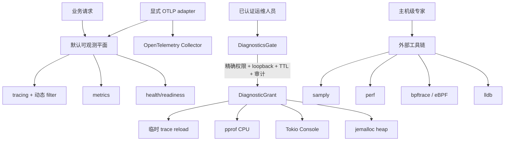
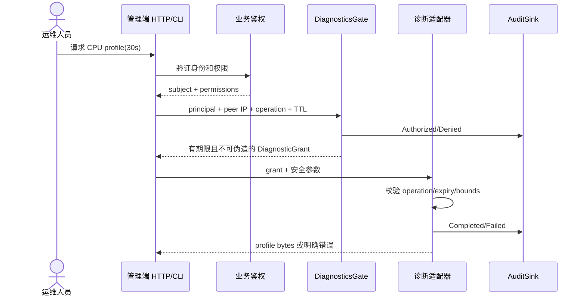

# ddd4r 性能与运行时诊断设计

> 状态：已实现基础能力；Linux heap profiler 的真实运行证据由 CI 产生  
> 更新日期：2026-07-24  
> 适用范围：ddd4r 默认应用、运维控制面和性能工程

## 1. 设计结论

ddd4r 不追求复制 Arthas。Rust 原生程序没有 JVM 字节码插桩、完整运行时类型元数据和类热替换，因此采用三层能力模型：

1. `tracing`、`metrics`、`health` 默认编译并随应用存在；
2. CPU pprof、Tokio Console、jemalloc heap profiler 必须由业务工程显式增加 crate，并且每次使用都必须获得有期限的诊断授权；
3. samply、perf、bpftrace/eBPF、lldb 永远是进程外工具，不进入 ddd4r 应用依赖图。



## 2. crate 边界

| crate | 默认进入 `ddd4r` | 编译开关 | 运行授权 | 当前状态 |
|---|---:|---|---:|---|
| `ddd4r-observability` | 是 | `ddd4r` 默认 feature `observability` | 管理端动态调级需授权适配器 | 已实现并测试 |
| `ddd4r-observability-otlp` | 否 | 业务工程显式依赖 | 不适用；属于遥测出口，不是诊断控制面 | traces/metrics/logs adapter 已实现并测试 |
| `ddd4r-diagnostics` | 否 | 显式依赖 | 是 | 已实现并测试 |
| `ddd4r-diagnostics-tracing` | 否 | 显式依赖 | 是，`ddd4r:diagnostics:trace` | 已实现并测试 |
| `ddd4r-diagnostics-pprof` | 否 | 显式依赖 | 是，`ddd4r:diagnostics:cpu` | Unix 已实测 |
| `ddd4r-diagnostics-tokio-console` | 否 | feature `runtime` + `tokio_unstable` | 是，`ddd4r:diagnostics:tasks` | 显式 feature 已验证 |
| `ddd4r-diagnostics-heap` | 否 | Linux 显式依赖 | 是，`ddd4r:diagnostics:heap` | macOS 边界已测；Linux CI 测试已配置 |

诊断 crate 不由 `ddd4r` facade 的 `default` 或 `full` feature 引入。这样可以保证业务方仅仅升级 ddd4r 时，不会意外打开监听端口、替换全局 allocator 或携带生产 profiling 后端。

## 3. 默认可观测平面

### 3.1 初始化

```rust
use ddd4r::observability::{
    LogFormat, ObservabilityBuilder, ObservabilityConfig,
};

let observability = ObservabilityBuilder::new(ObservabilityConfig {
    service_name: "order-service".to_owned(),
    filter: "info,order_service=debug".to_owned(),
    log_format: LogFormat::Json,
})
.install()?;
```

安装完成后默认具备：

- 可动态重载的 `tracing_subscriber::EnvFilter`；
- 结构化 compact/JSON 日志；
- 进程级 metrics recorder；
- `ddd4r_health_ready` 默认 gauge；
- 包含 `ddd4r.runtime` 的 liveness/readiness 注册表。

`install()` 是进程级一次性操作。重复安装 tracing subscriber 或 metrics recorder 会明确失败，不静默覆盖业务已有的全局状态。

### 3.2 健康与指标

Web adapter 只负责把以下稳定模型映射到 HTTP，不在 observability core 中绑定 Axum/Actix：

- `HealthRegistry::report()`：输出 overall status、ready 和组件状态；
- `InMemoryRecorder::snapshot()`：供测试、最小运行时和后续 exporter adapter 消费；
- Prometheus 等 exporter 保持可选，不进入默认内核；
- OTLP 由独立 `ddd4r-observability-otlp` crate 提供，不进入 `ddd4r` facade 的 `default` 或 `full` feature。

### 3.3 显式 OpenTelemetry OTLP 导出

OpenTelemetry Rust 当前把 traces、metrics、logs 都标记为 Beta，因此 ddd4r 把协议适配与默认本地能力隔离。业务工程需要显式依赖：

```toml
[dependencies]
ddd4r = "=0.1.0-alpha.1"
ddd4r-observability-otlp = "=0.1.0-alpha.1"
```

```rust
use ddd4r::observability::{ObservabilityBuilder, ObservabilityConfig};
use ddd4r_observability_otlp::{OtlpConfig, OtlpRuntime};

let mut otlp = OtlpConfig::default();
otlp.resource.service_name = "order-service".to_owned();
otlp.resource.service_namespace = Some("commerce".to_owned());
otlp.resource.service_version = Some(env!("CARGO_PKG_VERSION").to_owned());

let runtime = OtlpRuntime::install(
    otlp,
    ObservabilityBuilder::new(ObservabilityConfig::default()),
)?;

// 应用优雅退出时：
runtime.shutdown()?;
```

实现边界：

- OTLP/HTTP protobuf 默认发往 `http://127.0.0.1:4318`；明文 HTTP 仅允许 loopback，远程 Collector 必须使用 HTTPS；
- endpoint 禁止携带用户名、密码、query、fragment 或 `/v1/{signal}`，三个 signal 路径由 adapter 统一生成；
- 默认启用 traces 和 metrics，logs 必须显式开启；日志仍以 `tracing` 为应用入口，通过 `opentelemetry-appender-tracing` 转换；
- traces 使用 parent-based ratio sampler，并限制 span 队列、batch、attributes 和 events；
- metrics 同时保留本地快照并导出，默认最多 4096 个 series、每个 series 32 个 labels、字段 256 bytes；用户 ID、token、订单号等高基数字段不得作为 label；
- HTTP/MQ 调用通过 `W3cPropagation` 提取和注入 Trace Context 与 Baggage；
- `OtlpRuntime` 必须与应用同生命周期，优雅退出时调用 `force_flush()` 或 `shutdown()`；Drop 仅作为兜底。

生产部署优先把应用接到同机或同集群 OpenTelemetry Collector，再由 Collector 负责认证、重试、批处理、路由和厂商后端适配。ddd4r 不允许把 token 写进 endpoint URL，也不把 Collector 故障升级为业务请求故障。

## 4. 诊断授权模型



默认策略：

| 操作 | 权限 | 最大 TTL |
|---|---|---:|
| 临时 tracing filter | `ddd4r:diagnostics:trace` | 600 秒 |
| CPU pprof | `ddd4r:diagnostics:cpu` | 60 秒 |
| Tokio task 观测 | `ddd4r:diagnostics:tasks` | 3600 秒 |
| heap profile | `ddd4r:diagnostics:heap` | 60 秒 |
| 外部工具元数据 | `ddd4r:diagnostics:external` | 60 秒 |

默认仅接受 loopback 管理通道。若业务明确允许远程管理，必须在外层同时落实 mTLS/强身份认证、网络隔离、精确 RBAC、速率限制和审计留存，再显式调用 `DiagnosticPolicy::allow_remote()`。

## 5. 显式诊断组件

### 5.1 临时提升 tracing 级别

管理端不得直接调用永久 `TraceController::reload()`。受信任控制面应通过 `ddd4r-diagnostics-tracing`：

```rust
AuthorizedTraceController::reload_for(
    &grant,
    observability.trace_controller(),
    "debug,sqlx=trace",
    Duration::from_secs(30),
)?;
```

TTL 结束后自动恢复旧 filter；更晚的人工变更具有更高 generation，不会被旧定时器覆盖。

### 5.2 CPU pprof

业务工程显式增加：

```toml
[dependencies]
ddd4r-diagnostics = "=0.1.0-alpha.1"
ddd4r-diagnostics-pprof = "=0.1.0-alpha.1"
```

在获得 `CpuProfile` grant 后调用 `CpuProfiler::capture()`；它严格按 grant TTL 采样并自动停止，返回 protobuf pprof bytes。实现限制采样频率为 1–1000 Hz，且整个进程只允许一个 CPU profiler session；调用 future 被取消时 RAII guard 也会停止采样。

### 5.3 Tokio Console

编译命令必须显式出现：

```bash
RUSTFLAGS="--cfg tokio_unstable" \
  cargo build -p my-service \
  --features ddd4r-diagnostics-tokio-console/runtime
```

运行时仍需 `AsyncTasks` grant。服务器只允许绑定 loopback，retention 必须非零且不得超过 grant TTL；到期后 server future 被停止。ddd4r 不把 Tokio Console 协议直接暴露到公网，因为该协议本身不承担业务级鉴权。

### 5.4 jemalloc heap profiler

仅在 Linux 目标编译真实实现，并显式选择 jemalloc 全局 allocator：

```bash
MALLOC_CONF="prof:true,prof_active:false,lg_prof_sample:19" \
  ./target/profiling/my-service
```

采样默认不激活；获得 `HeapProfile` grant 后才能 activate、snapshot、deactivate。activate 会安装与 grant TTL 相同的自动停用保护，手工 deactivate 会使旧定时器失效，避免误停后续 session。snapshot 返回 gzipped protobuf pprof。macOS/Windows 会返回明确的 unavailable，不伪装支持。

## 6. 外部工具链

外部工具永远不作为 Cargo 依赖或应用 feature：

| 工具 | 使用时机 | 准备 |
|---|---|---|
| samply | macOS/Linux 本地交互式 CPU 火焰图 | `--profile profiling` 和匹配符号 |
| perf | Linux CPU、cache、调度分析 | perf 权限、frame pointer、符号 |
| bpftrace/eBPF | 无侵入 attach、系统调用和 uprobe | 主机 eBPF 权限、稳定符号、专家操作 |
| lldb | 崩溃、死锁、底层状态 | attach 权限、匹配二进制和符号 |

ddd4r 提供 `[profile.profiling]`：

```toml
[profile.profiling]
inherits = "release"
debug = 1
strip = "none"
```

推荐外部采样构建：

```bash
RUSTFLAGS="-C force-frame-pointers=yes" cargo build --profile profiling
samply record ./target/profiling/my-service

RUSTFLAGS="-C force-frame-pointers=yes" cargo build --profile profiling
perf record -F 99 -g --call-graph dwarf ./target/profiling/my-service
perf report
```

eBPF 和 lldb 的具体命令依赖部署环境、内核权限和符号名，不由应用自动执行。生产操作必须经过主机权限审批，并记录目标 PID、二进制 digest、commit、时间窗口和操作者。

## 7. 性能回归

`ddd4r-observability` 提供 Criterion 基准：

```bash
cargo bench -p ddd4r-observability --bench observability
```

当前基准覆盖：

- 三组件 health report；
- counter、gauge、histogram 的连续写入；
- metric 名称与 labels 基数策略校验。

基准结果只用于建立 commit 间趋势，不直接承诺生产 TPS。业务级 P50/P95/P99、鉴权、数据库、Outbox、MQ 和文档基准仍按 `IMPLEMENTATION_PLAN.md` Phase 6 在固定硬件和固定依赖版本上采集。

## 8. CI 与验收

CI 分为两条独立路径：

1. 默认路径不设置 `tokio_unstable`，验证普通业务工程不会隐式携带诊断后端；
2. 显式诊断路径设置 `tokio_unstable` 和 `MALLOC_CONF`，编译所有 feature，并真实运行 CPU pprof、Tokio Console layer 和 Linux heap profile 测试。

`tools/verify_diagnostics_policy.py` 另外从 Cargo manifest 验证：facade 默认包含 observability、任何 profiler crate 和 OTLP exporter 都没有进入 facade 依赖、OTLP adapter 显式依赖本地 observability core、Tokio Console 默认 feature 为空。

本地最低验证：

```bash
cargo test -p ddd4r-observability
cargo test -p ddd4r-observability-otlp
cargo test -p ddd4r-diagnostics
cargo test -p ddd4r-diagnostics-tracing
cargo test -p ddd4r-diagnostics-pprof
cargo test -p ddd4r-diagnostics-tokio-console

RUSTFLAGS="--cfg tokio_unstable" \
  cargo test -p ddd4r-diagnostics-tokio-console --features runtime
```

Linux heap 真实验证：

```bash
MALLOC_CONF="prof:true,prof_active:false,lg_prof_sample:19" \
DDD4R_TEST_HEAP_PROFILER=1 \
  cargo test -p ddd4r-diagnostics-heap \
  explicitly_enabled_heap_profile_round_trip
```

## 9. 明确未完成的边界

- OTLP traces/metrics/logs adapter 已实现；Prometheus exporter 尚未实现，默认 recorder 仍不是生产时序数据库；
- 尚未在真实 Collector 与厂商后端上执行端到端导出、断网丢弃、证书轮换和容量压测，因此不能把“本地测试通过”表述为生产链路已验证；
- Axum/Actix 管理端点尚未实现；现有授权核心和 profiler adapter 已为其提供稳定边界；
- Linux heap round-trip 只能由 Linux CI/主机给出证据，本地 macOS 仅能验证“不支持时明确失败”；
- 尚未建立固定硬件上的业务级性能预算，不能从微基准推导生产吞吐量；
- eBPF、perf 和 lldb 的可用性属于部署主机能力，不属于 ddd4r 应用“100% 实现”口径。
- `jemalloc_pprof 0.9.0` 经 `paste` 引入未维护告警；当前没有上游安全替代，已设置截至 2026-09-30 的发布阻断期限，届时必须升级或移除 heap profiler。
- 当前最新 `rumqttc 0.25.1` 仍直接依赖存在 RustSec 告警的 `rustls-webpki 0.102.8`；同样设置 2026-09-30 期限，不把临时豁免当作已修复。
