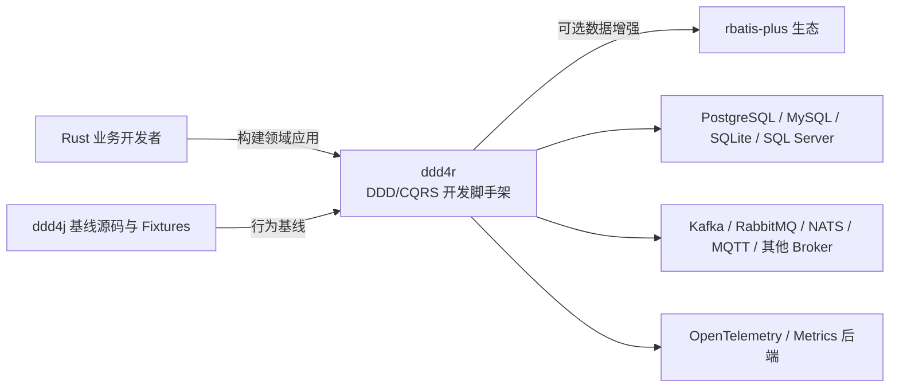
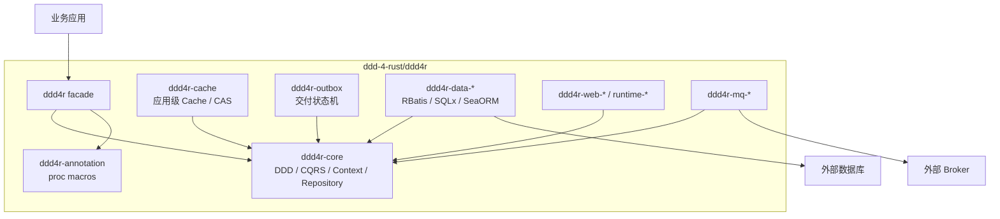
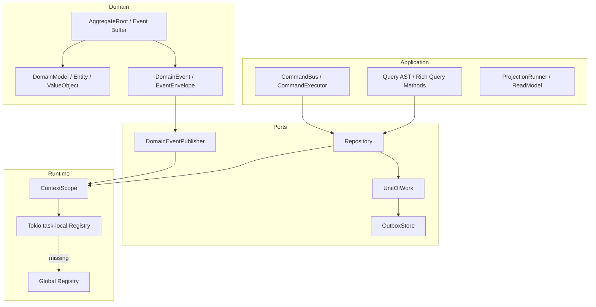
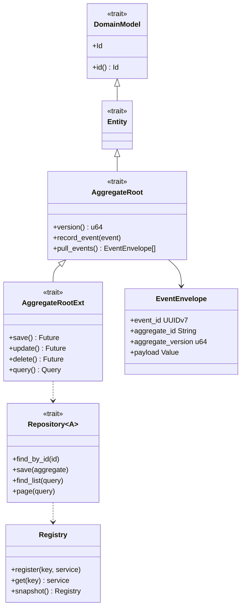

# ddd4r 架构

本文面向框架使用者、适配器维护者和发布工程师，记录 ddd4r 从系统边界到核心代码的 C4 架构。
架构变更必须在同一 PR 更新本文件和对应 ADR。

## L1：System Context

## L2：Container

## L3：Core Components

## L4：核心类型关系

## 关键不变量

1. 领域核心不依赖 Web、数据库、消息组件或 DI 容器。
2. task-local 服务覆盖全局默认服务，作用域结束后不得泄漏。
3. 同一 Registry 中相同 key/type 重复注册必须失败。
4. 聚合与 Outbox 在正式数据适配器中必须原子提交。
5. Auth 失败关闭；缓存失败开放且不得改变数据库查询结果。
6. 所有 82 项迁移状态由根目录 `port-manifest.toml` 管理。
