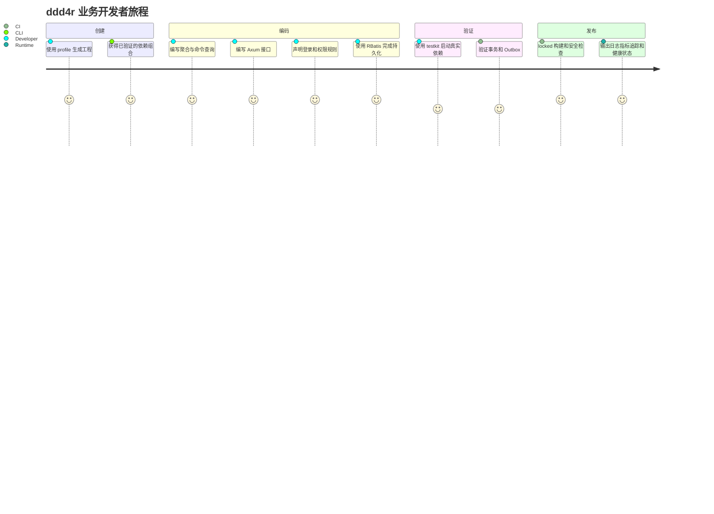
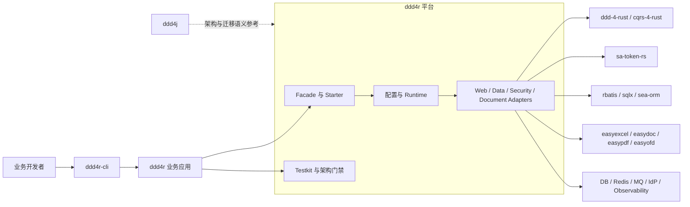
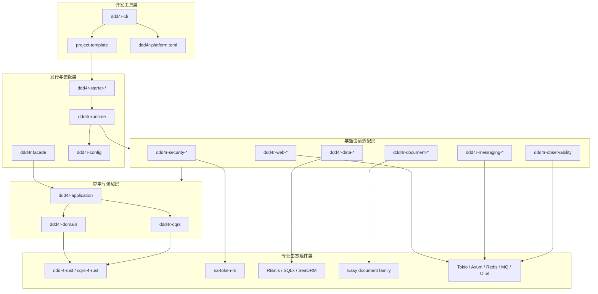
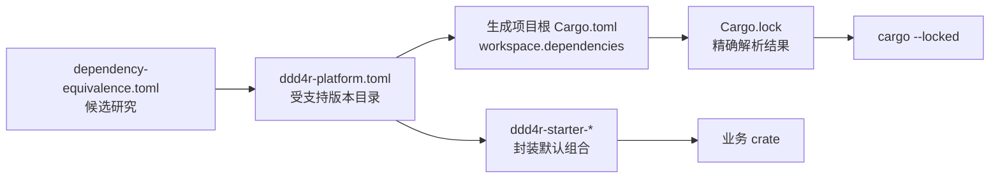
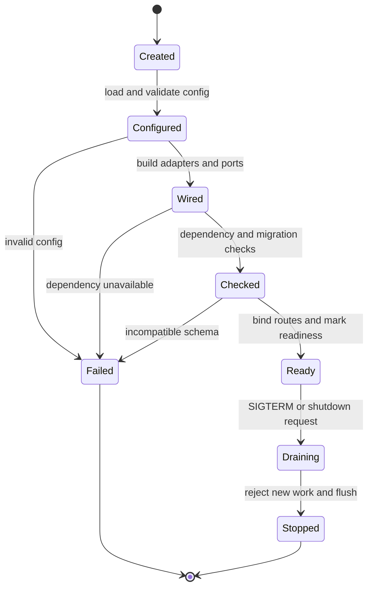
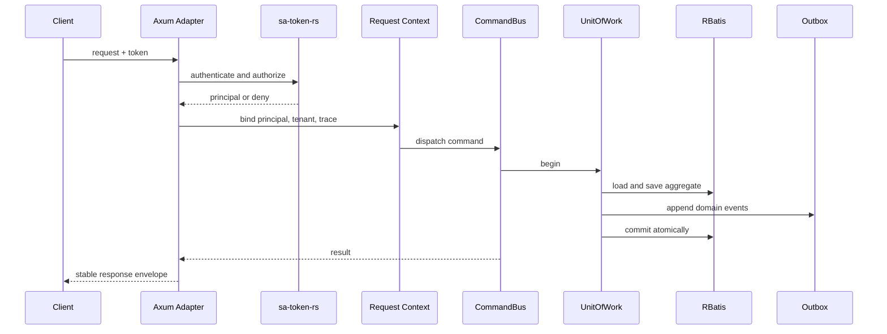
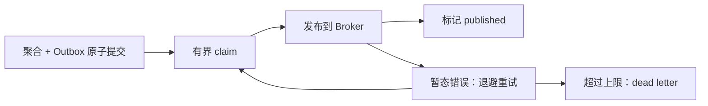
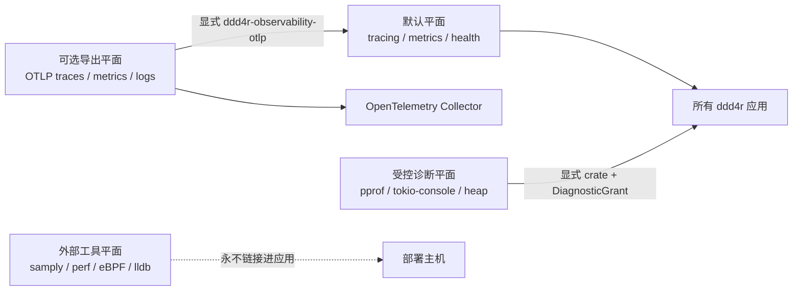
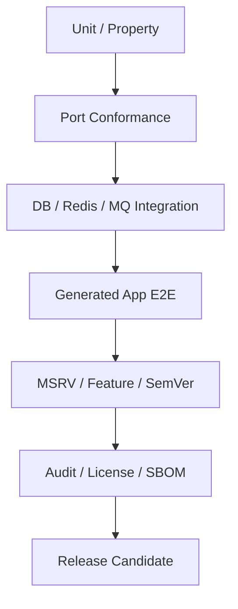

# ddd4r 架构设计文档

> 文档版本：1.0
>
> 架构状态：目标架构已确定，仓库正在迁移
>
> 适用版本：`0.1.x` 至 `1.0.0`
>
> 最近更新：2026-07-23
>
> 实施计划：[IMPLEMENTATION_PLAN.md](./IMPLEMENTATION_PLAN.md)
>
> 当前实现证据：[PORT_STATUS.md](../PORT_STATUS.md)、[port-manifest.toml](../port-manifest.toml)

## 1. 文档目的

本文定义 ddd4r 的产品边界、目标架构、crate 组织、运行时装配、依赖版本治理、扩展机制和生产级质量门禁。

本文不是 ddd4j Java API 的逐类翻译说明。ddd4j 仍是架构思想、模块划分和业务语义的重要参考，但 ddd4r 的最终形态由 Rust 语言特性、Cargo 约束和 Rust 生态组件决定。

文中状态标签含义如下：

| 标签 | 含义 |
|---|---|
| `[已实现]` | 当前仓库中存在可执行实现和测试证据 |
| `[部分实现]` | 已有核心代码，但未形成业务开箱即用闭环 |
| `[设计目标]` | 本文确定的目标架构，尚未全部实现 |
| `[实验性]` | 可供验证，但不进入默认技术栈和稳定兼容承诺 |
| `[非目标]` | ddd4r 明确不承担的职责 |
| `[待确认]` | 需要通过基准、许可证评审或发布实验才能最终决定 |

## 2. 执行摘要

ddd4r 的定义是：

> 一套面向 Rust 企业应用的 DDD/CQRS 快速开发脚手架与组件发行平台，让业务团队可以用少量依赖和统一配置，快速完成接口、鉴权、数据访问、事务、事件、文档处理、可观测性和测试装配。

ddd4r 不直接照搬 ddd4j 的实现，而是复用以下经验：

- DDD 核心与基础设施适配器分离；
- 应用层通过端口使用仓储、消息、鉴权和外部能力；
- starter 负责组合依赖、默认配置和启动装配；
- dependencies/BOM 负责统一兼容版本；
- testkit 和示例负责证明完整业务链路；
- 架构规则和发布门禁防止模块失控。

在 Rust 中，这些能力由四层共同实现：

1. **领域基础层**：`ddd-4-rust`、`cqrs-4-rust` 提供 DDD/CQRS 模型与执行语义；
2. **生态组件层**：`sa-token-rs`、`rbatis`、Easy 文档组件族等提供专门能力；
3. **ddd4r 平台层**：提供统一配置、适配桥、runtime、starter、testkit、可观测性和生产约束；
4. **开发工具层**：`ddd4r-cli` 生成和升级业务工程，落地受支持的版本组合与 `Cargo.lock`。

因此，ddd4r 更接近“Rust 生态中的 Spring Boot + DDD 应用脚手架”，而不是“ddd4j 的 Rust 镜像”。

## 3. 架构驱动因素

### 3.1 业务驱动

| 驱动因素 | 架构响应 |
|---|---|
| 新项目需要快速开始接口开发 | 提供 profile、starter、项目模板和 CLI |
| 业务开发者不应逐个选择依赖版本 | 提供平台版本目录、starter 封装和锁文件工作流 |
| 鉴权不能每个项目重复拼装 | 以 `sa-token-rs` 为底座提供统一安全 starter |
| Java 项目迁移需要熟悉的 DDD/CQRS 结构 | 保留聚合、命令、查询、仓储、事件、应用服务等业务词汇 |
| 不同项目偏好不同 Web/数据框架 | 核心端口稳定，Axum/Actix、RBatis/SQLx/SeaORM 以独立 adapter/starter 提供 |
| 文档处理是企业项目常见能力 | 对 EasyExcel/EasyDoc/EasyPDF/EasyOFD 做统一平台集成 |
| 项目必须可上线、可诊断、可升级 | 默认接入 tracing、metrics、health、审计、供应链和兼容门禁 |

### 3.2 技术约束

- Rust 依赖解析没有 Maven `dependencyManagement` 的可传递 BOM 导入语义；
- Cargo feature 是加法合并，不能安全表达互斥技术栈；
- `[patch.crates-io]` 只由最终工作区根生效，依赖 crate 内的 patch 不会传递给业务项目；
- Rust 静态链接会放大许可证兼容风险；
- Tokio 异步任务不能用 OS ThreadLocal 承载请求身份和上下文；
- proc-macro 可替代部分 Java 注解体验，但不能依赖运行时反射扫描；
- crate 的公开 API、feature 和最低 Rust 版本共同构成兼容合同。

### 3.3 成功标准

一个全新业务服务应能完成以下旅程：



首个稳定版本的端到端验收样例是：生成订单服务，定义聚合、命令和查询，使用 Axum 暴露 API，使用 `sa-token-rs` 做登录与权限拦截，使用 RBatis 完成事务持久化和 Outbox，最后导出 Excel 并通过真实数据库与 Redis 集成测试。

## 4. 系统边界与非目标

### 4.1 系统上下文



### 4.2 ddd4r 负责

- 统一项目结构、依赖方向和业务开发约定；
- 选择、验证和发布受支持的组件组合；
- 提供 DDD/CQRS facade、Web/Data/Security/Document 适配；
- 提供运行时配置、启动装配、健康检查和优雅退出；
- 提供 starter、testkit、CLI、模板和升级工具；
- 提供事务、Outbox、幂等、审计、可观测性等跨组件约束；
- 提供版本目录、兼容矩阵、锁文件和发布证据；
- 为 Java 到 Rust 的迁移提供语义映射，而不是强制 API 同形。

### 4.3 ddd4r 不负责

| 非目标 | 边界说明 |
|---|---|
| `[非目标]` 逐类逐方法复制 ddd4j | Java 专属反射、注解和框架桥接只保留迁移结论 |
| `[非目标]` 自研数据库驱动或 ORM | 使用 RBatis、SQLx、SeaORM |
| `[非目标]` 重复实现 Sa-Token | 复用 `sa-token-rs`，ddd4r 只负责平台装配和领域上下文桥接 |
| `[非目标]` 成为 OAuth2/OIDC 身份提供商 | 默认对接外部 IdP；ddd4r 业务服务作为客户端或资源服务器 |
| `[非目标]` 重写 Excel/Doc/PDF/OFD 引擎 | 复用 Easy 文档组件族 |
| `[非目标]` 保存业务聚合或业务表结构 | 业务应用拥有领域模型、迁移脚本和数据 |
| `[非目标]` 运行不受信任的动态插件 | 1.0 前扩展均为编译期 crate 组合 |
| `[非目标]` 为所有 Rust Web/ORM 框架提供同等级支持 | 明确默认栈、支持栈和实验栈 |

## 5. 当前状态与目标差距

### 5.1 当前实现快照

截至 2026-07-24：

- `[部分实现]` 当前仓库有 98 个 Cargo manifest；数量只用于描述规模，不计为能力完成度；
- 旧移植账本记录 82 个 ddd4j artifact：4 个 `complete`、15 个 `in_progress`、63 个 `scaffolded`；
- `[已实现]` DDD 核心、Repository/Context、部分 CQRS、Cache、Outbox、三种数据后端和部分 MQ 状态机已有真实代码与测试；
- `[部分实现]` 当前 Auth 有自研 `SubjectEngine` 和内存会话实现，但尚未形成 Web + Redis + starter 的业务闭环；
- `[未实现]` `ddd4r-web-core` 和多数 runtime/web/broker crate 仍是描述符空壳；
- `[未实现]` `ddd4r-dependencies`、`ddd4r-bom` 当前是 `publish = false` 的空包，不具备 Maven BOM 等价能力；
- `[部分实现]` `ddd4r` facade 默认组合 macros 和 observability，可选 cache/outbox，但尚未提供完整应用 profile；
- `[已实现]` `ddd4r-observability` 已提供默认 tracing、metrics、health，受控诊断已拆分为独立授权 crate；
- `[已实现]` `ddd4r-observability-otlp` 已提供显式 OTLP/HTTP traces、metrics、可选 logs 和 W3C 上下文传播，不进入 facade 默认依赖；
- `[部分实现]` CPU pprof 已在 Unix 本地实测，Tokio Console 显式 feature 已编译验证；Linux heap profiler 的真实运行证据由 Linux CI 产生；
- `[已验证]` 默认与 all-features 的完整 locked workspace check、test、Clippy 和 rustdoc 已在本地通过；
- `[部分验证]` 供应链许可证和来源通过；heap/MQTT 新增的上游 RustSec 告警采用截至 2026-09-30 的显式临时例外，Linux CI 与远端发布工作流仍需实际运行。

### 5.2 如何理解“未完成”

旧账本中的 4.88% 仅代表“ddd4j artifact 严格移植完成率”，不能代表新产品定义下的 ddd4r 平台完成率。

新架构采用能力闭环进度：

| 能力闭环 | 当前判定 | 1.0.0 标准 |
|---|---|---|
| 项目生成与版本治理 | 未实现 | CLI 可生成、同步和升级锁定项目 |
| DDD/CQRS | 部分实现 | 领域、命令、查询、事务、事件样例全绿 |
| Web | 未实现 | Axum 默认栈可直接启动，Actix 支持矩阵明确 |
| Data | 部分实现 | RBatis 默认栈闭环，SQLx/SeaORM 契约通过 |
| Security | 部分实现且方向需调整 | `sa-token-rs` starter + Redis + Web 权限闭环 |
| Document | 未集成 | Easy 组件族经统一 facade 和 starter 使用 |
| Observability | 核心已实现，exporter/Web 端点待集成 | 默认日志、指标、追踪、健康和审计可用 |
| Release | 部分实现 | locked、MSRV、SemVer、安全、SBOM、许可证门禁全绿 |

结论：**当前 ddd4r 不是 100% 完成；它拥有若干可复用内核，但还没有形成可供业务项目开箱即用的平台产品。**

## 6. 架构原则与关键决策

### ADR-A01：平台化复用，不做字面移植

- ddd4j 提供模块设计和迁移语义；
- Rust 生态项目提供专门能力；
- ddd4r 提供组合、约束、默认值和开发体验；
- 旧 82 artifact 账本保留为兼容研究证据，不再决定目标 crate 数量。

### ADR-A02：默认技术栈必须唯一

首个稳定版本的默认栈为：

| 能力 | 默认组件 |
|---|---|
| Async runtime | Tokio |
| Web | Axum |
| DDD | `ddd-4-rust` |
| CQRS | `cqrs-4-rust` |
| Data | RBatis |
| Security | `sa-token-rs` |
| Serialization | Serde |
| HTTP client | Reqwest |
| Cache | Moka + `redis-rs` |
| Observability | tracing + metrics + OpenTelemetry |
| Runtime template | MiniJinja |
| Document | EasyExcel/EasyDoc/EasyPDF/EasyOFD Rust 组件 |

Actix、SQLx、SeaORM、Casbin、Askama、OAuth2/OIDC 客户端属于受支持的可选组合。Diesel、内嵌 OAuth2 Provider 和尚未验证的商业 SDK 不进入 1.0 默认栈。

### ADR-A03：技术替代项使用独立 starter

Cargo feature 是加法合并。Web 框架和 ORM 等互斥选择不能只靠 feature 表达，必须拆成独立 adapter 和 starter：

- `ddd4r-starter-web-axum`
- `ddd4r-starter-web-actix`
- `ddd4r-starter-data-rbatis`
- `ddd4r-starter-data-sqlx`
- `ddd4r-starter-data-seaorm`

facade feature 只用于可以安全叠加的能力，例如 document、observability、outbox。

### ADR-A04：显式装配替代反射与自动扫描

ddd4r 使用 builder、trait、derive 和显式模块注册实现启动装配。任何“自动配置”必须能在编译期或启动报告中解释其来源，禁止隐式全局扫描。

### ADR-A05：异步上下文使用 Tokio task-local

身份、租户、trace、事务和请求元数据必须通过显式参数或 Tokio task-local 传播。禁止使用 OS ThreadLocal 作为异步请求上下文。

### ADR-A06：安全底座复用 sa-token-rs

ddd4r 不继续扩张与 `sa-token-rs` 重叠的会话、JWT、OAuth2、SSO 和 Web 鉴权实现。现有自研 Auth 在迁移期只保留：

- 与领域上下文的桥接；
- 兼容旧公开 API 的薄适配；
- 可复用但 `sa-token-rs` 尚不具备的通用抽象；
- 迁移验证所需的 conformance fixtures。

新功能优先贡献到或集成自 `sa-token-rs`。

### ADR-A07：发布应用必须提交 Cargo.lock

库 crate 使用 SemVer 范围和平台兼容矩阵；CLI 生成的业务应用必须提交 `Cargo.lock`，CI 和发布构建必须使用 `--locked`。

### ADR-A08：许可证是架构门禁

`ddd-4-rust` 和 `cqrs-4-rust` 当前声明 `LGPL-3.0-or-later`。Rust 静态链接场景下的发行义务必须在 re-export、starter 和业务二进制发布前完成正式评审。

在评审完成前：

- 不宣称所有 profile 都可无条件商用发布；
- 平台目录记录许可证和公开 API 暴露关系；
- CI 生成 SBOM 并执行许可证策略；
- `[待确认]` 是否隔离、替换或调整这两个基础组件的发布方式。

## 7. 目标逻辑架构



依赖方向必须从外向内。领域层不得依赖 Web、ORM、Redis、MQ、模板或具体鉴权框架。

## 8. 目标 crates/ monorepo

crate 目录和 Cargo package 统一使用 kebab-case；Rust 源码目录和文件保持 snake_case；类型使用 PascalCase。

```text
crates/
├── ddd/
│   ├── ddd4r-domain/
│   ├── ddd4r-cqrs/
│   ├── ddd4r-event-sourcing/
│   └── ddd4r-application/
├── data/
│   ├── ddd4r-data/
│   ├── ddd4r-data-rbatis/
│   ├── ddd4r-data-sqlx/
│   ├── ddd4r-data-seaorm/
│   ├── ddd4r-data-outbox/
│   └── ddd4r-data-testkit/
├── security/
│   ├── ddd4r-security/
│   ├── ddd4r-security-sa-token/
│   ├── ddd4r-security-casbin/
│   └── ddd4r-security-testkit/
├── web/
│   ├── ddd4r-web/
│   ├── ddd4r-web-axum/
│   ├── ddd4r-web-actix/
│   ├── ddd4r-web-session-tower/
│   └── ddd4r-web-testkit/
├── document/
│   ├── ddd4r-document/
│   ├── ddd4r-document-excel/
│   ├── ddd4r-document-doc/
│   ├── ddd4r-document-pdf/
│   └── ddd4r-document-ofd/
├── template/
│   ├── ddd4r-template/
│   ├── ddd4r-template-minijinja/
│   └── ddd4r-template-askama/
├── platform/
│   ├── ddd4r-config/
│   ├── ddd4r-cache/
│   ├── ddd4r-scheduler/
│   ├── ddd4r-messaging/
│   ├── ddd4r-observability/
│   ├── ddd4r-observability-otlp/
│   ├── ddd4r-diagnostics/
│   ├── ddd4r-diagnostics-tracing/
│   ├── ddd4r-diagnostics-pprof/
│   ├── ddd4r-diagnostics-tokio-console/
│   ├── ddd4r-diagnostics-heap/
│   └── ddd4r-runtime/
├── starter/
│   ├── ddd4r-starter/
│   ├── ddd4r-starter-web-axum/
│   ├── ddd4r-starter-web-actix/
│   ├── ddd4r-starter-data-rbatis/
│   ├── ddd4r-starter-data-sqlx/
│   ├── ddd4r-starter-data-seaorm/
│   ├── ddd4r-starter-security-sa-token/
│   ├── ddd4r-starter-cqrs/
│   ├── ddd4r-starter-document/
│   ├── ddd4r-starter-observability/
│   └── ddd4r-starter-full/
├── test/
│   ├── ddd4r-test/
│   ├── ddd4r-test-container/
│   └── ddd4r-test-architecture/
└── tooling/
    ├── ddd4r-cli/
    ├── ddd4r-codegen/
    └── ddd4r-project-template/
```

### 8.1 crate 职责

| 类型 | 职责 | 禁止事项 |
|---|---|---|
| `ddd4r-domain` | 领域基础抽象与统一 prelude | 不依赖基础设施 |
| `ddd4r-application` | 用例、事务边界、命令查询协调 | 不直接持有具体 ORM |
| `ddd4r-*-adapter` | 把外部组件映射到稳定端口 | 不泄漏不必要的第三方类型 |
| `ddd4r-starter-*` | 依赖组合、默认 feature、配置 Schema、启动模块 | 不承载业务逻辑 |
| `ddd4r-runtime` | 生命周期、装配、健康、关闭 | 不成为 Service Locator |
| `ddd4r-test-*` | contract、容器、fixture、架构规则 | 不进入生产依赖 |
| `ddd4r-cli` | 创建、增删能力、同步平台、升级 | 不直接修改用户业务源码 |

### 8.2 facade 设计

业务项目有两种消费方式：

1. 简单项目依赖 `ddd4r` facade，并启用安全可叠加的 feature；
2. 生产项目依赖一个或多个明确 starter，以获得可预测的技术栈。

`ddd4r::prelude` 只 re-export 稳定且高频的领域/应用 API，不全量 re-export 外部生态，避免 SemVer 和许可证边界失控。

## 9. 组件选型与集成边界

### 9.1 DDD/CQRS

| 组件 | 角色 | ddd4r 集成 |
|---|---|---|
| `ddd-4-rust` | 聚合、实体、值对象、领域事件 | `ddd4r-domain` 薄 facade 和约束扩展 |
| `cqrs-4-rust` | Command/Query、总线和适配 | `ddd4r-cqrs`、`ddd4r-application` |
| `ddd-cqrs-4-rust-example` | 可运行验收基线 | 转化为 starter 生成工程和 E2E fixture |

### 9.2 数据访问

| 组件 | 支持级别 | 定位 |
|---|---|---|
| RBatis | 默认 | MyBatis 风格、动态 SQL、显式 SQL 控制 |
| SQLx | 支持 | 原生 SQL、编译期检查、轻量服务 |
| SeaORM | 支持 | ORM、实体关系和迁移 |
| Diesel | 实验候选 | 1.0 不承诺官方 starter |

所有后端必须通过统一 conformance suite：CRUD、查询、分页、乐观锁、事务、回滚、聚合与 Outbox 原子性。

### 9.3 安全

| 能力 | 组件 | ddd4r 边界 |
|---|---|---|
| 登录、Session、踢下线、JWT、SSO、OAuth2 | `sa-token-rs` | 默认安全底座 |
| Redis/Moka/Memory DAO | `sa-token-rs` DAO crates | starter 选择和配置 |
| Axum/Actix 拦截 | `sa-token-rs` Web crates | 统一错误、上下文和审计桥 |
| 复杂 RBAC/ABAC | Casbin | 可选授权策略 adapter |
| OIDC 客户端/资源服务器 | `openidconnect`、`oauth2`、JWT/JWKS | 对接外部 IdP |
| 身份提供商 | Keycloak、Kanidm、Zitadel 等 | ddd4r 外部系统 |

附件中“Rust 没有 Sa-Token 等价实现”的结论对当前本地生态已经过时，因为 `sa-token-rs` 已覆盖 core、DAO、JWT、SSO、OAuth2、remember-me、API key、多 Web 框架和模板插件。ddd4r 应直接整合它，而不是重新组合一套相互竞争的鉴权内核。

### 9.4 模板

- MiniJinja：默认运行时模板，适合邮件、代码生成和动态文本；
- Askama：可选编译期模板，适合类型安全 SSR；
- Tera：由 `sa-token-rs` 或业务按需使用，1.0 不再重复提供同类默认 adapter。

### 9.5 文档

`ddd4r-document` 定义统一的导入、导出、模板、流式 I/O 和 Web 响应集成，不抽象掉各格式独有能力：

- `ddd4r-document-excel` → `easyexcel-rs`
- `ddd4r-document-doc` → `easydoc-rs`
- `ddd4r-document-pdf` → `easypdf-rs`
- `ddd4r-document-ofd` → `easyofd-rs`

## 10. Cargo 版本平台设计

### 10.1 为什么不能复制 Maven BOM

Cargo 的 `[workspace.dependencies]` 只能被同一 workspace 成员通过 `.workspace = true` 继承，不能像 Maven BOM 一样被任意下游项目 import。虚拟 `ddd4r-bom` crate 也不能覆盖另一个项目的第三方版本。

因此 ddd4r 使用四层机制实现等价开发体验：



### 10.2 四个权威对象

| 对象 | 作用 | 是否业务项目直接使用 |
|---|---|---|
| `dependency-equivalence.toml` | 记录 Java→Rust 候选、拒绝项和研究证据 | 否 |
| `ddd4r-platform.toml` | 记录 ddd4r 已选择、已测试、受支持的版本组合 | 由 CLI 使用 |
| 根 `Cargo.toml` | 表达本项目实际采用的 workspace dependency | 是 |
| `Cargo.lock` | 固定业务应用精确依赖图 | 是，必须提交 |

### 10.3 平台目录最小 Schema

```toml
platform-version = "0.1.0-alpha.1"
rust-version = "1.97.1"

[components.axum]
version = "0.8"
status = "default"
license = "MIT"
public-api = false
verified-at = "2026-07-23"

[components.rbatis]
version = "4.9.6"
status = "default"
license = "Apache-2.0"
public-api = true
source-policy = "registry-or-approved-revision"
```

正式 Schema 还必须包含：MSRV、feature、支持状态、许可证、安全公告、验证命令、公开 API 暴露、patch 要求、替代组件和兼容窗口。

### 10.4 组件状态

- `default`：默认 profile 使用并持续验证；
- `supported`：官方 adapter 和兼容矩阵覆盖；
- `experimental`：允许试用，不承诺稳定 API；
- `external`：只记录互操作，不由 ddd4r 发布；
- `rejected`：已评估但不采用，并记录原因。

### 10.5 patch 规则

当前根 workspace 对 `rbdc` 使用 `[patch.crates-io]`。这只能保护 ddd4r 自身，不能从发布 crate 传递给业务项目。

生产策略按优先级排序：

1. 推动或等待已修复的 registry 正式版本；
2. 发布组织维护且可审计的兼容版本；
3. 临时由 CLI 在业务项目根注入精确 revision patch，并显示风险和退出条件；
4. 禁止依赖 starter 隐式假设下游 patch 会生效。

### 10.6 业务使用体验

```bash
ddd4r new order-service --profile web-service
ddd4r add security-sa-token --features redis,jwt
ddd4r add document-excel
ddd4r add cqrs
ddd4r sync
ddd4r doctor
```

生成后的成员 crate 只引用平台别名：

```toml
[dependencies]
ddd4r-starter-web-axum.workspace = true
ddd4r-starter-data-rbatis.workspace = true
ddd4r-starter-security-sa-token.workspace = true
```

## 11. Runtime 与启动装配

### 11.1 生命周期



### 11.2 RuntimeBuilder

`RuntimeBuilder` 接收显式模块：

```rust,ignore
let runtime = Ddd4rRuntime::builder()
    .config(config)
    .module(AxumModule::new())
    .module(RbatisModule::new(database))
    .module(SaTokenModule::redis(redis))
    .module(ObservabilityModule::otel())
    .build()
    .await?;
```

模块必须声明：

- 名称、版本、依赖和冲突；
- 配置 Schema 和默认值；
- 启动检查、readiness、shutdown hook；
- 注册的端口、route、metric 和资源；
- 是否包含迁移或外部副作用。

启动报告必须列出版本、profile、配置来源、启用模块、外部依赖、数据库迁移、降级项和安全告警，但不能输出秘密。

## 12. 关键运行时流程

### 12.1 HTTP 命令请求



### 12.2 Outbox 发布



约束：

- 有副作用的命令必须有幂等键或可证明的业务去重；
- 只有明确暂态错误可以重试；
- ACK 时机必须与业务提交语义一致；
- tenant、trace、correlation、causation 必须随事件传播；
- 未知事件版本进入隔离或死信，不能静默丢弃。

## 13. 接口与错误合同

ddd4r 的稳定接口分为：

| 接口类型 | 稳定性 |
|---|---|
| 领域和应用 trait | 稳定，遵循 SemVer |
| adapter 配置 Schema | 稳定，允许带废弃期演进 |
| starter feature | 稳定，变更需兼容矩阵 |
| 第三方原始类型 re-export | 默认禁止或标记实验性 |
| CLI 模板结构 | 按模板版本迁移 |

统一错误分类：

| 分类 | 是否重试 | HTTP 默认映射 | 处理 |
|---|:---:|---:|---|
| `Validation` | 否 | 400 | 返回字段错误 |
| `Unauthenticated` | 否 | 401 | 重新认证 |
| `Forbidden` | 否 | 403 | 审计拒绝 |
| `NotFound` | 否 | 404 | 业务处理 |
| `Conflict` | 条件 | 409 | 重新读取版本 |
| `RateLimited` | 是 | 429 | 遵循 retry-after |
| `DependencyUnavailable` | 有界 | 503 | 熔断或降级 |
| `Internal` | 视情况 | 500 | correlation ID + 告警 |

## 14. 配置、秘密与特性

配置优先级：

```text
命令行临时覆盖
  > 环境变量和 Secret 引用
  > profile 配置
  > ddd4r.toml
  > 安全默认值
```

要求：

- 配置必须有可版本化 Schema；
- 未知关键字段默认启动失败；
- secret 只使用引用，不进入仓库、日志和启动报告；
- feature 只控制编译期能力，运行时配置不能假装启用未编译能力；
- 安全相关默认值 fail closed；
- 配置变更若支持热更新，必须原子替换并保留上一个有效版本。

## 15. 安全与信任边界


硬约束：

- token、密码、cookie、密钥不得进入日志、metric label 或 trace attribute；
- 权限 provider、DAO、Redis 异常不得降级为允许；
- Session 必须支持轮换、撤销、踢下线和并发登录策略；
- Cookie 默认 `HttpOnly`、`Secure`、合理的 `SameSite`；
- 多租户资源访问必须同时校验 subject 和 tenant scope；
- 外部 OIDC/JWKS 缓存必须处理密钥轮换、过期和未知 `kid`；
- 所有安全拒绝都有结构化审计，但审计内容必须最小化。

## 16. 可靠性与恢复

| 失败 | 默认行为 | 恢复策略 |
|---|---|---|
| 数据库不可用 | 写请求拒绝，readiness 失败 | 有界重连，恢复后校验迁移 |
| Redis/Session 不可用 | 鉴权 fail closed | 熔断并告警 |
| Broker 不可用 | 业务事务可提交 Outbox | 后台重试，积压告警 |
| OTel 后端不可用 | 业务继续，观测缓冲有界 | 丢弃低优先级遥测并告警 |
| 配置错误 | 启动失败 | 修正或回滚配置 |
| 优雅退出 | 停止接收新请求 | 等待在途事务，flush Outbox/telemetry |

数值 SLO 在真实基准建立前标记为 `[待确认]`。1.0 至少提供测量方法和 profile 基线，不在缺少环境证据时承诺虚假吞吐量。

## 17. 可观测性与控制面

### 17.1 三平面原则



- tracing、metrics、health 默认存在；
- OTLP 是显式出口 adapter，不进入 facade 的 `default`/`full` feature；远端明文 HTTP、URL 凭据和无界 metric labels 均被拒绝；
- pprof、Tokio Console、heap profiler 必须显式编译，并由精确权限、loopback、TTL 和审计共同授权；
- samply、perf、bpftrace/eBPF、lldb 永远是外部工具链；
- `full` feature 也不得隐式引入 profiler、替换 allocator 或开放诊断端口。

### 17.2 信号标准

| 信号 | 必需字段 | 约束 |
|---|---|---|
| 日志 | timestamp、level、component、trace_id、error_code | 不记录凭据和正文大对象 |
| 指标 | request、latency、error、pool、queue、outbox、auth deny | user/token 不做 label |
| 追踪 | HTTP、Command、Repository、Outbox、MQ、外部 HTTP | 跨边界传播 trace context |
| 审计 | subject、tenant、action、resource、outcome、correlation | 不保存秘密，支持完整性保护 |

### 17.3 健康端点

- liveness：进程和 runtime 是否工作；
- readiness：必需依赖、迁移和核心模块是否就绪；
- startup：冷启动是否仍在合法窗口；
- diagnostics：仅授权访问，返回模块版本和脱敏状态。

`ddd4r-observability` 已实现默认 subscriber、可重载 filter、有界内存 metrics recorder 和健康注册表；`ddd4r-observability-otlp` 已实现 OTLP/HTTP traces、metrics、可选 logs、统一 resource、W3C Trace Context/Baggage 传播和 provider 生命周期。Prometheus exporter 以及 Axum/Actix 端点仍为后续 adapter。完整的安全边界、构建方式和运维命令见 [PERFORMANCE_DIAGNOSTICS.md](./PERFORMANCE_DIAGNOSTICS.md)。

## 18. 部署形态

| Profile | 默认组合 | 场景 |
|---|---|---|
| `web-service` | Axum + RBatis + Sa-Token + tracing | 标准业务 API |
| `cqrs-service` | web-service + CQRS + Outbox + MQ | 命令查询分离服务 |
| `worker` | Runtime + Data + MQ + Observability | 消费者和定时任务 |
| `document-service` | web-service + Easy 文档族 | 导入导出与文档服务 |
| `full` | 所有默认能力 | 示例和集成验证，不建议直接用于最小生产镜像 |

部署流程：

```text
build --locked
→ SBOM / license / vulnerability checks
→ migration compatibility check
→ canary or rolling deploy
→ readiness gate
→ SLO observation
→ promote or rollback
```

数据库变更遵循 expand-migrate-contract；事件和配置至少保留一个兼容窗口；回滚不能假设破坏性 Schema 可以自动恢复。

## 19. 扩展模型

1.0 的扩展是编译期 crate，不是运行时动态插件。

扩展接入要求：

- 依赖稳定端口而不是 starter 内部实现；
- 提供 config Schema、健康检查和关闭逻辑；
- 通过对应 conformance suite；
- 声明 feature、MSRV、许可证和支持级别；
- 不使用隐藏全局状态；
- 不泄漏秘密，不创建无界任务、队列或 metric label；
- 进入 `ddd4r-platform.toml` 后才能被 CLI 标记为 `supported`。

如未来需要 WASM 或进程隔离插件，必须另立 ADR，补充能力权限、签名、资源配额、崩溃隔离和升级回滚协议。

## 20. 兼容性、版本与发布

### 20.1 兼容维度

| 维度 | 门禁 |
|---|---|
| Rust/MSRV | 最低版本 + stable 双矩阵 |
| crate API | cargo-semver-checks |
| feature | feature powerset 或受控 profile 组合 |
| adapter | Web/Data/Security conformance |
| 数据库 | SQLite 快速测试 + 受支持真实数据库矩阵 |
| 配置 | Schema 向前兼容和废弃周期 |
| 事件 | 版本化 envelope 和重放测试 |
| 供应链 | audit、deny、SBOM、provenance |

### 20.2 发布列车

- 所有 ddd4r crate 使用统一平台版本；
- 专业生态组件保留自身版本，平台目录记录已验证组合；
- 发布顺序：core/ports → adapters → runtime → starters → CLI/templates → facade；
- release candidate 必须用生成的外部业务项目验证，不能只测试 monorepo 内 path dependency；
- 稳定版本升级提供 migration guide 和 `ddd4r upgrade --check`。

## 21. 测试与架构验收



最低测试集：

- 聚合不变量、命令幂等、查询语义和事件版本；
- RBatis/SQLx/SeaORM 事务与 Outbox 原子性；
- Sa-Token 登录、权限、踢下线、Redis 失效和 Axum/Actix 拦截；
- request/task-local 在并发、取消和 panic 下不泄漏；
- 生成工程在仓库外使用 registry/git 依赖执行 `cargo test --locked`；
- 依赖方向、禁用 feature 组合、循环依赖和不允许的 re-export；
- 升级、配置回滚、数据库故障、Redis 故障、MQ 积压和优雅退出。
- 默认构建不得包含 profiler；显式 diagnostics 构建必须验证授权拒绝、TTL、loopback、单实例和平台边界；
- Linux CI 使用 `MALLOC_CONF` 实测 heap profile，Unix 实测 CPU pprof，`tokio_unstable` 专用任务验证 Tokio Console；
- Criterion 基准只作回归趋势证据，生产容量结论必须来自固定环境的业务级基准。

## 22. 风险与技术债

| 风险 | 等级 | 处理 |
|---|---|---|
| LGPL 基础 crate 与静态链接发行义务 | 高 | 许可证评审作为 Phase 0 发布阻断项 |
| 九个关联仓库版本和发布节奏不一致 | 高 | 平台目录、兼容矩阵、统一 RC 验证 |
| 当前 90 个 manifest 大量空壳造成“看似完整” | 高 | 能力闭环口径，空壳不计完成 |
| 自研 Auth 与 sa-token-rs 重复 | 高 | 冻结新增，迁移到薄适配 |
| 根 patch 不能传递给业务项目 | 高 | registry 修复优先，CLI 临时显式注入 |
| starter 过度 re-export 导致 SemVer 污染 | 中 | 稳定 prelude 白名单 |
| Cargo feature 组合爆炸 | 中 | 独立 starter + 支持 profile 矩阵 |
| ddd4j 迁移需求反向绑架 Rust API | 中 | 兼容账本与产品 roadmap 分离 |
| profiler 被默认暴露 | 高 | 独立 crate、无 facade 默认 feature、精确权限、loopback、TTL 和审计 |
| 生产二进制缺符号导致无法诊断 | 中 | `profiling` profile 保留符号，外部采样强制 frame pointer |
| 缺少真实性能数据 | 中 | Criterion 回归基准已起步；业务基准环境和预算在发布前固化 |

## 23. 路线图摘要

| 阶段 | 目标 | 关键出口 |
|---|---|---|
| Phase 0 | 定位、目录、版本平台和许可证治理 | 新架构成为权威，发布级 locked 基线全量确认 |
| Phase 1 | DDD/CQRS 与 Runtime 最小内核 | 无 Web 的用例和事务测试闭环 |
| Phase 2 | Axum + RBatis 纵向切片 | 未鉴权 CRUD/事务/Outbox 可运行 |
| Phase 3 | Sa-Token 安全闭环 | 登录、权限、Redis、踢下线和审计可运行 |
| Phase 4 | Starter、CLI 和外部工程验证 | 业务项目不手工管理组件版本 |
| Phase 5 | 文档、模板、消息和可观测性 | 默认可观测核心已实现；exporter、Web 端点和其他企业能力继续完成 |
| Phase 6 | 兼容、故障、供应链和 1.0 | 所有发布门禁通过 |

详细任务、依赖、验收与回滚见 [IMPLEMENTATION_PLAN.md](./IMPLEMENTATION_PLAN.md)。

## 24. 证据与待确认事项

### 24.1 当前证据

- 根 [Cargo.toml](../Cargo.toml) 中的 workspace、依赖和 patch；
- 旧迁移状态 [PORT_STATUS.md](../PORT_STATUS.md) 与 [port-manifest.toml](../port-manifest.toml)；
- 当前代码 C4 摘要 [architecture/README.md](./architecture/README.md)；
- 历史 ADR 索引 [adrs/README.md](./adrs/README.md)；
- 本地关联仓库的 Cargo manifest、crate 结构和示例。

### 24.2 待确认

- `[待确认]` `ddd-4-rust`、`cqrs-4-rust` 的最终许可证与发布集成方式；
- `[待确认]` ddd4r 的最终 MSRV；当前根仓库是 1.97.1，主要关联项目多为 1.88；
- `[待确认]` 首批发布到 crates.io、私有 registry 或组织 registry 的组合策略；
- `[待确认]` 生产 SLO、吞吐量、内存和启动时间预算，必须通过固定环境基准获得；
- `[待确认]` 旧 `ddd4r-auth*` 公开 API 的兼容周期和废弃版本；
- `[待确认]` 旧 82 artifact 账本中哪些映射继续作为 migration adapter，哪些归档为 `not-applicable`。

## 25. 变更规则

以下变更必须同时更新本文、实施计划和 ADR：

- 默认 Web、Data、Security、Runtime 或 DDD/CQRS 基础组件变更；
- crate 分层和依赖方向变更；
- 平台版本目录 Schema 或 lock 策略变更；
- 安全信任边界、租户模型或身份模型变更；
- starter/profile 的兼容承诺变更；
- 发布许可证策略和 MSRV 变更。
